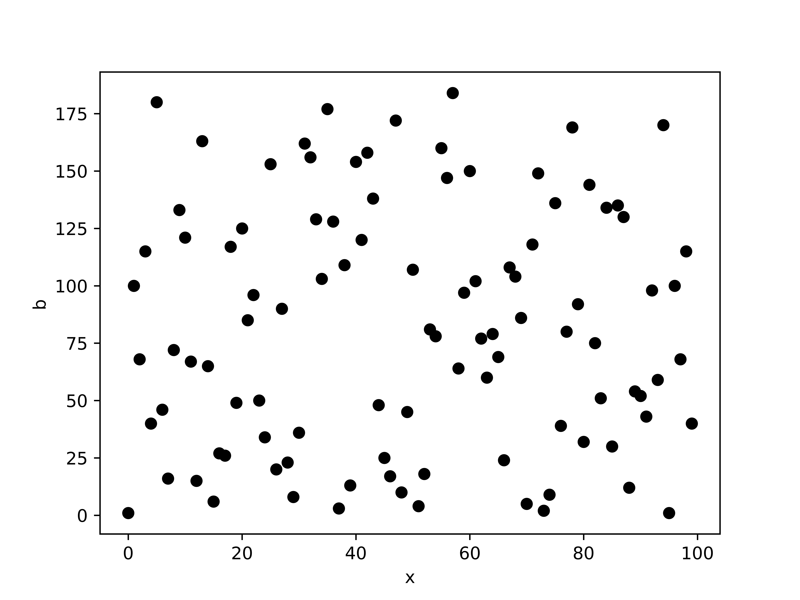
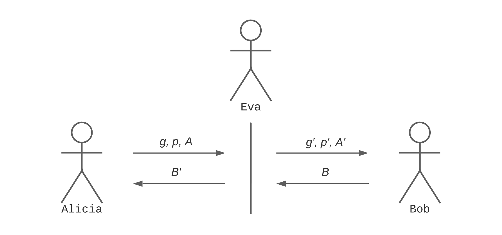

# Diffie-Hellman

 

  

> Los inicios de la criptografía asimétrica.

[Whitfield Diffie](https://en.wikipedia.org/wiki/Whitfield_Diffie) y [Martin Hellman](https://en.wikipedia.org/wiki/Martin_Hellman) son dos criptólogos y matemáticos conocidos por crear uno de los primeros protocolos de clave pública. En 1976, en su artículo [New Directions in Cryptography](https://www-ee.stanford.edu/~hellman/publications/24.pdf), resolvieron uno de los problemas más importantes de la aplicación de métodos criptográficos en la computación: el intercambio de claves a través de un canal inseguro. El método creado se denomina el sistema de intercambio de claves de Diffie-Hellman y sentó unas bases sobre las que se ha construido lo que hoy día conocemos como criptografía asimétrica.

A continuación no solo se trata el funcionamiento del sistema que desarrollaron, sino que también se presentan sus vulnerabilidades y cómo explotarlas.

## Requisitos

Para poder entender este tema se recomienda al lector tener conocimientos básicos de cálculo e intermedios de álgebra. Además, es importante destacar que los ejemplos proporcionados están desarrollados en el lenguaje de programación Python, por lo que para el aprovechamiento total del contenido se recomienda conocer un poco de dicho lenguaje.

## Índice

1. [Introducción](#introducción)
    1. [Problema del logaritmo discreto](#problema-del-logaritmo-discreto)
    2. [Problema del intercambio de claves en un canal inseguro](#problema-del-intercambio-de-claves-en-un-canal-inseguro)
    3. [Aplicaciones en el mundo real](#aplicaciones-en-el-mundo-real)
2. [Generación de la clave compartida](#generación-de-la-clave-compartida)
3. [Cifrando con la clave compartida](#cifrando-con-la-clave-compartida)
4. [Criptoanálisis](#criptoanálisis)
    1. [Debilidades matemáticas](#debilidades-matemáticas)
        1. [Orden del grupo G y Pohlig-Hellman](#orden-del-grupo-g-y-pohlig-hellman)
        2. [Propiedades del generador g](#propiedades-del-generador-g)
    2. [Man-in-the-Middle](#man-in-the-middle)
        1. [Manipulación del parámetro g](#manipulación-del-parámetro-g)
        2. [Manipulación de los parámetros A y B](#manipulación-de-los-parámetros-a-y-b)
        3. [Manipulación del parámetro p](#manipulación-del-primo-p)
    3. [Sucesores](#sucesores)
        1. [ElGamal](#elgamal)
        2. [Curvas elípticas](#curvas-elípticas)

## Introducción

El sistema Diffie-Hellman es un protocolo criptográfico utilizado para el intercambio de claves. No encripta los mensajes por sí solo, sino que se utiliza en combinación con otros sistemas de cifrado simétricos, como [AES](https://en.wikipedia.org/wiki/Advanced_Encryption_Standard), para asegurar que Alicia y Bob puedan comunicarse de forma segura.

Esto se debe a que Diffie y Hellman crearon el concepto de clave pública y privada con el simple objetivo de que los dos interlocutores pudieran generar una clave compartida, que posteriormente sería usada en el sistema criptográfico simétrico en cuestión.

En este intercambio de claves, un agente al que podemos llamar Eva, puede estar viendo lo que Alicia y Bob envían para consensuar la clave compartida, y aún así no ser capaz de obtenerla. Este fin se obtiene gracias al hecho de que resolver el problema del logaritmo discreto, bajo ciertas circunstancias, no es realizable en un tiempo menor a la edad del universo.

### Problema del logaritmo discreto

El problema del logaritmo discreto es un problema matemático que se refiere a encontrar un número entero positivo $x$ que satisfaga la ecuación:

$$a^x \equiv b \bmod m$$

donde $a$, $b$ y $m$ son números enteros positivos conocidos. 

Si despejamos $x$, resultaría en que:

$$x \equiv \log{_a}{b} \bmod m$$

Podríamos pensar que puede ser sencillo: vamos tomando valores de $x$ y usando fuerza bruta llegará un momento que encontremos una que cumpla la ecuación. Para valores pequeños sí, podríamos hacerlo, pero en Diffie-Hellman actualmente se utilizan valores de 2048 bits, convirtiendo el problema en irrealizable.

De hecho, en la actualidad no se conoce ningún algoritmo determinista que pueda resolver el problema del logaritmo discreto en un tiempo polinómico para todos los casos. Existen algunos algoritmos estocásticos que funcionan mejor o peor en determinadas situaciones, aunque en ninguna de ellas proporcionan una garantía real de que encontrarán la solución correcta. Más adelante, en la sección de [criptoanálisis](#criptoanálisis), se verá que, con ciertos parámetros mal elegidos, es posible aplicar algún algoritmo que nos permita recuperar el valor de $x$.

Sin entrar en el porqué de que no exista ningún algoritmo determinista para resolver este problema, se puede presentar un ejemplo gráfico que ayuda al entendimiento. Imaginemos unos valores definidos de $a$ y $m$:

$$b \equiv 100^x \bmod 191$$

     

La figura anterior representa los valores de $b$ para $x$ de $1$ a $100$. La relación de estas dos variables es visualmente aleatoria. Si hubiésemos representado un logaritmo en el conjunto de números reales veríamos una línea continua que define la función de la ecuación correspondiente. Sin embargo, el logaritmo en módulo $191$ muestra una distribución caótica. Esta figura es una prueba visual de que encontrar un algoritmo que estandarice este cálculo no es tarea fácil.

> [Ver graficador del logaritmo discreto.](scripts/dlog_graphicator.py)

Utilizando un lenguaje algebraico, se denomina logaritmo discreto de $b$ en base $a$ a la solución $x$ de la ecuación $a^x = b$ donde $a$ y $b$ son elementos de un grupo cíclico finito $G$ módulo $m$. Se recuperará esta definición formal más adelante en la sección de [generación de claves](#generación-de-la-clave-compartida).

### Problema del intercambio de claves en un canal inseguro

Un canal inseguro es un medio de comunicación que no garantiza la confidencialidad, integridad y autenticidad de los datos transmitidos. Si dos partes desean comunicarse de forma segura a través de este tipo de canal, necesitan utilizar técnicas de cifrado para proteger sus mensajes.

Los cifrados simétricos requieren una clave secreta compartida. Si las partes carecen de cualquier otra comunicación a través de canales seguros, deben consensuarla sabiendo que cualquier tercero podría estar observando. Este es el problema del intercambio de claves y hasta la llegada de Diffie-Hellman se usaban sistemas que tenían grandes limitaciones y no eran completamente seguros.

### Aplicaciones en el mundo real

El sistema de intercambio de claves Diffie-Hellman se utiliza en la actualidad en la implementación de algunos protocolos criptográficos como [TLS/SSL](https://en.wikipedia.org/wiki/Transport_Layer_Security). Sin embargo, tras el descubrimiento del ataque [Logjam](https://en.wikipedia.org/wiki/Logjam_(computer_security)), se recomendó implementarlo con tamaños de claves más grandes o en combinación con otros criptosistemas. Por ejemplo, actualmente se utilizan las curvas elípticas junto con Diffie-Hellman en el sistema [ECDH](https://en.wikipedia.org/wiki/Elliptic-curve_Diffie%E2%80%93Hellman), protocolo que se desarrollará en la sección de [sucesores](#sucesores). En resumen, aunque Diffie-Hellman sigue siendo utilizado, presenta distintas variaciones que buscan mejorar su seguridad en respuesta a los ataques descubiertos en estos más de 40 años.

## Generación de la clave compartida

Sea $G$ un grupo multiplicativo de enteros de módulo $p$ primo y un generador $g$ del grupo que es una raíz primitiva de $p$:
1. Alicia elige un valor aleatorio $a$ y envía a Bob $A \equiv g^a \bmod p$.
2. Bob elige un valor aleatorio $b$ y envía a Alicia $B \equiv g^b \bmod p$. 
3. Alicia calcula $S \equiv B^a \bmod p$ mientras que Bob calcula el mismo valor por medio de $S \equiv A^b \bmod p$.

$$S \equiv B^a \bmod p \equiv g^{ba} \bmod p$$

$$S \equiv A^b \bmod p \equiv g^{ab} \bmod p$$

Eva, que está observando el envío de $A$ y $B$ y conoce los parámetros públicos $p$ y $g$, no puede obtener $S$ sin resolver el problema del logaritmo discreto.

> [Ver calculadora de generadores del grupo multiplicativo de campos finitos.](scripts/is_generator.py)

Veámoslo en números:
1. Escogemos el primo $p = 37$ y el generador $g = 13$.
2. Alicia elige $a = 14$ y Bob $b = 9$.
3. $A \equiv 13^{14} \bmod 37 \equiv 25$. $B \equiv 13^{9} \bmod 37 \equiv 6$.
4. $S \equiv 25^9 \bmod 37 \equiv 6^{14} \bmod 37 \equiv 36$.

Siendo el primo elegido pequeño, como en el ejemplo dado con $p = 37$, sería tarea trivial realizar un ataque de fuerza bruta para resolver el logaritmo discreto. En este caso, se tendrían que probar todos los $a$ y $b$ desde $1$ hasta $p - 1$ hasta encontrar los valores que cumplan la congruencia. Este ataque no es realizable con $a$ y $b$ más grandes.

> [Ver implementación de la generación de claves.](scripts/diffie_hellman.py)

## Cifrando con la clave compartida

Una vez consensuada la clave compartida $S$, los interlocutores pueden hacer uso de un sistema de cifrado simétrico para el envío de los mensajes privados. 

Para cifrar un mensaje, el emisor utiliza, por ejemplo, el algoritmo simétrico AES junto con la clave compartida y un vector de inicialización único. El mensaje cifrado y el vector se envían al receptor. 

Para descifrar, el receptor utiliza el algoritmo de descifrado con la clave compartida y el mismo inicializador utilizado en el proceso de cifrado, recuperando así el mensaje original.

## Criptoanálisis

La seguridad de Diffie-Hellman está determinada por la dificultad de resolver el logaritmo discreto. Sin embargo, no solo poder resolverlo podría comprometer la seguridad, sino que también se debe comprobar que la comunicación no permite que terceros intercepten o manipulen el intercambio de claves. 

### Debilidades matemáticas

La elección adecuada de parámetros es crucial para la seguridad del intercambio de claves Diffie-Hellman. Uno de los parámetros más importantes es el tamaño del grupo $G$, que se define mediante el número primo $p$. Una mala elección podría permitir a un atacante calcular el logaritmo discreto.

Además, también es importante seleccionar un tamaño lo suficientemente grande de claves $a$ y $b$ y elegir un generador válido $g$.

#### Orden del grupo $G$ y Pohlig-Hellman

El orden de un grupo $G$ se refiere al número de elementos que hay en el grupo. Equivale a $p - 1$.

Por ejemplo, si $p=7$, entonces el grupo toma los valores ${1,2,3,4,5,6}$. Al haber 6 elementos, el orden de este grupo es 6.

La importancia de elegir un número primo seguro recae en que el orden del grupo sea seguro. Además de $p$ tener que ser un número primo muy grande, $p - 1$ no debe estar formado por múltiplos muy pequeños, ya que el logaritmo discreto podría ser resuelto por el algoritmo [Pohlig-Hellman](https://en.wikipedia.org/wiki/Pohlig%E2%80%93Hellman_algorithm).

Pohlig-Hellman es un algoritmo capaz de resolver logaritmos discretos en grupos finitos abelianos cuyo orden es un [número liso](https://en.wikipedia.org/wiki/Smooth_number). Un número liso es un entero que tiene únicamente factores primos muy pequeños en relación a su tamaño. Al ser una definición general, los matemáticos suelen referirse a números n-lisos, siendo $n$ el factor primo más grande que tiene.

Por ejemplo, el número 840 es un número 7-liso, ya que su factorización en números primos es $2^3 \cdot 3 \cdot 5 \cdot 7$ y todos los factores son menores o iguales a 7.

Siendo el orden de $p$ un n-liso siendo $n$ lo suficientemente pequeño, el algoritmo Pohlig-Hellman reduce el problema del logaritmo discreto del grupo $G$ a problemas resolubles en grupos más pequeños. Cada uno de estos subgrupos obtiene su solución y combinándolas se consigue la solución final en el grupo original.

La teoría matemática del algoritmo Pohlig-Hellman abarca desde el [teorema de Lagrange](https://en.wikipedia.org/wiki/Lagrange%27s_theorem_(group_theory)) hasta el algoritmo [baby-step giant-step](https://en.wikipedia.org/wiki/Baby-step_giant-step). Por la complejidad de los teoremas, es mejor tratarlos por separado en el futuro.

En la realidad, para evitar este ataque se busca que $p$ sea lo que se denomina un [primo seguro](https://en.wikipedia.org/wiki/Safe_prime). Este caso particular de números primos sigue la estructura tal que $p = 2q + 1$ siendo $q$ también un número primo. $p$ pasa a llamarse primo seguro y $q$ primo de [Sophie Germain](https://en.wikipedia.org/wiki/Safe_and_Sophie_Germain_primes#Sophie_Germain_prime). Así nos aseguramos que el orden de $p$ solo es divisible por 2 y el resto es lo suficientemente grande para evitar el algoritmo Pohlig-Hellman.

> [Ver caso práctico de Pohlig-Hellman.](scripts/pohlig_hellman.py)

#### Propiedades del generador $g$

El generador $g$ en el intercambio de claves Diffie-Hellman o raíz primitiva de $p$ es un valor entre $2$ y $p - 1$ que, elevado a sucesivas potencias, devuelve todos los elementos del grupo $G$ sin ciclos. Por ejemplo, si consideramos el grupo multiplicativo ${1, 2, 3, 4, 5, 6}$, el valor 3 es generador porque:

$$3^1 = 3$$

$$3^2 = 2$$

$$3^3 = 6$$

$$3^4 = 4$$

$$3^5 = 5$$

$$3^6 = 1$$

Se han generado secuencialmente todos los elementos del grupo sin repetición.

Aplicado al intercambio de claves, si $g$ no genera todos los elementos del grupo, los valores $A$ y $B$ que comparten Alicia y Bob para consensuar la clave $S$ no son cualquier valor del grupo $G$, sino que pertenecen a un nuevo subgrupo de $G$ generado por $g$. Si se estudia el logaritmo discreto en ese subgrupo se reduce la complejidad.

Presentada la definición formal, cabe destacar que en la práctica raramente es así. El generador no tiene estrictamente que ser una raíz primitiva, pero si generar secuencialmente un grupo lo suficientemente grande para ser seguro. Las [recomendaciones actuales del instituto NIST](https://www.keylength.com/en/4/) marcan que para un grupo de 1024 bits, el tamaño de clave segura debería ser al menos 160 bits. De esta manera, si el subgrupo definido tiene de más de $2^{160}$ elementos, se considera seguro.

### Man-in-the-Middle

La manipulación de un tercero en el intercambio de claves Diffie-Hellman tiraría por tierra todos los esfuerzos de usar parámetros seguros en el problema del logaritmo discreto.

El ataque [Man-in-the-Middle](https://en.wikipedia.org/wiki/Man-in-the-middle_attack) (MITM) es una técnica utilizada por un atacante para interceptar y manipular la comunicación entre dos partes.

En el intercambio de claves Diffie-Hellman, este atacante podría recibir de Alicia $g$, $p$ y $A$, retener esa información, modificarla a su conveniencia, y enviar los parámetros modificados a Bob. Este es el caso base sobre el que se va a construir los siguientes problemas. Nuestro atacante Eva recibirá los parámetros enviados por Alicia y Bob y los manipulará para tratar de recuperar las claves privadas.

     

#### Manipulación del parámetro $g$

En esta sección se van a analizar distintos escenarios en los que se manipula el valor del generador, junto con sus respectivas explotaciones. En estos ataques se cambiará el valor de $g$ original por uno malicioso $g'$ mientras que $p$, $A$ y $B$ se mantendrán igual.

##### $g = 1$

Si Eva introduce $g = 1$, Bob calcula $B \equiv 1^b \bmod p \equiv 1$. 
La clave compartida para Alicia será $S \equiv 1^a \bmod p \equiv 1$. 

> [Ver caso práctico g = 1.](scripts/generator_1.py)

##### $g = p$

Si Eva introduce $g = p$, Bob calcula $B \equiv p^b \bmod p \equiv 0$.
La clave compartida para Alicia será $S \equiv 0^a \bmod p \equiv 0$.
En el caso $g = 0$ el resultado es el mismo.

> [Ver caso práctico g = p.](scripts/generator_p.py)

##### $g = p - 1$

Si Eva introduce $g = p - 1$, Bob calcula $B \equiv {(p - 1)}^b \bmod p$.

Probando distintos valores de $b$ se observa en pocas iteraciones que $B$ vale $1$ o $p - 1$. Específicamente vale $1$ cuando $b$ es par y $p - 1$ cuando es impar. Se puede demostrar con el siguiente razonamiento.

$$B \equiv (p-1)^b \pmod{p}$$

* Si $b$ es par, podemos escribir $(p-1)^b$ como $(p-1)^{2k}$ para un $k$ entero no negativo. 

$$(p-1)^{2k} = ((p-1)^2)^k = (p^2 - 2p + 1)^k \equiv (0 + 0 + 1)^k \bmod p \equiv 1$$

* Si $b$ es impar, podemos escribir $(p-1)^b$ como $(p-1)^{2k + 1}$ para un $k$ entero no negativo. 

$$(p-1)^{2k + 1} = (p-1)^{2k} \cdot (p-1) \equiv 1 \cdot (p - 1) \bmod p \equiv p - 1$$

La clave compartida para Alicia será $S \equiv 1^a \bmod p \equiv 1$ o $S \equiv {(p - 1)}^a \bmod p \equiv 1 | (p - 1)$. Cualquier mensaje de Alicia podrá ser leído con alguna de las dos claves posibles.

> [Ver caso práctico g = p - 1.](scripts/generator_p_1.py)

##### $g = A$

Si Eva introduce $g = A$, Bob calcula $B \equiv A^b \bmod p$.
Eva intercepta $B$, siendo $B \equiv A^b \bmod p \equiv g^{ab} \bmod p \equiv S$.

Este ataque se presenta en muy pocas situaciones, ya que Eva debe enviar una $B$ a Alicia de vuelta que sea equivalente a $g^b \bmod p$ y no a $A^b \bmod p$. Para lograr esto, Eva tendría que haber obtenido previamente el valor original de $B$. Esto sería posible si Bob no cambia su clave $b$ después de cada intercambio, práctica que es poco segura. Si fuese el caso, Eva tendría que observar dos intercambios de clave, guardaría el valor de $B$ en el primero sin intervenir mientras que en el segundo realizaría el ataque explicado. Eva podría leer mensajes tanto de Alicia como de Bob.

> [Ver caso práctico g = A.](scripts/generator_A.py)

Cabe señalar que, exceptuando el último caso, solo podríamos leer mensajes de Alicia porque la clave consensuada maliciosa solo la tendría ella.

#### Manipulación de los parámetros $A$ y $B$

En los parámetros $A$ y $B$ se pueden implementar los mismos ataques que en $g$.

$$A = 1 \rightarrow S \equiv 1^b \bmod p \equiv 1$$

$$A = p \rightarrow S \equiv p^b \bmod p \equiv 0$$

$$A = p - 1 \rightarrow S \equiv (p - 1)^b \bmod p \equiv 1 | (p - 1)$$

De la misma forma, se podrían indicar los mismos valores $B$ a Alicia y todos los mensajes serían legibles.

#### Manipulación del primo $p$

El primo $p$ es el encargado de asegurar el logaritmo discreto. Un atacante podría introducir un primo no demasiado grande para poder hacer fuerza bruta y calcular la clave compartida. Si el sistema solo comprobara el tamaño del número, se podría generar un primo vulnerable al ataque Pohlig-Hellman, como está descrito en la sección de [orden del grupo y Pohlig-Hellman](#orden-del-grupo-y-pohlig-hellman).

Todos los casos anteriores se reservan para el estudio teórico del sistema, no son ataques aplicables a la realidad. Actualmente, los protocolos que utilizan Diffie-Hellman comprueban cuidadosamente los parámetros antes de compartirlos con cualquier otra parte del intercambio. Además, usan claves de un solo uso y estrategias para evitar la manipulación de un tercero.

## Sucesores

El sistema de intercambio de claves Diffie-Hellman fue el primer contacto con la criptografía asimétrica y marcó precedentes en el campo de los protocolos criptográficos. En esta sección se explican brevemente distintas variaciones e implementaciones muy relacionadas con este.

### ElGamal

[ElGamal](https://en.wikipedia.org/wiki/ElGamal_encryption) es un protocolo criptográfico de clave pública propuesto por [Taher ElGamal](https://en.wikipedia.org/wiki/Taher_Elgamal) en 1985. Se basa en el problema del logaritmo discreto en un grupo cíclico finito, al igual que Diffie-Hellman. A diferencia de este, no requiere del uso de otro cifrado simétrico para encriptar mensajes, sino que utiliza una serie de operaciones matemáticas relacionadas con el problema mencionado para asegurar la privacidad de la comunicación. 

### Curvas elípticas

En la década de 1990, se comenzó a explorar la aplicación de [curvas elípticas en la criptografía](https://en.wikipedia.org/wiki/Elliptic-curve_cryptography). 

Una curva elíptica es una figura geométrica definida por la ecuación:

$$ y^2 = x^3 + ax + b$$

Estas estructuras matemáticas complejas se utilizan en combinación con algunos sistemas criptográficos como Diffie-Hellman o [DSA](https://en.wikipedia.org/wiki/Digital_Signature_Algorithm) para mejorar la seguridad. 

El caso de uso específico de Diffie-Hellman ([ECDH](https://en.wikipedia.org/wiki/Elliptic-curve_Diffie%E2%80%93Hellman)) supone sustituir el grupo cíclico finito definido por $p$ por el grupo definido por una curva elíptica. Las operaciones dentro de este nuevo grupo requieren menos recursos computacionales y el logaritmo discreto se convierte en un problema más complejo aún.

Este tema se tratará más adelante en un futuro apartado dedicado únicamente a las curvas elípticas.