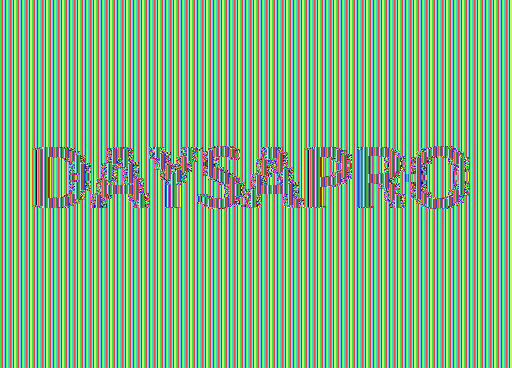

# Modos de operación de cifrado de bloques

[]()

[](https://github.com/Daysapro) [](https://github.com/Daysapro/cryptonomicon)

[]() []()


> Las bases sobre las que se construyen los cifrados simétricos modernos.

Los modos de operación son algoritmos que proveen una capa adicional de seguridad a los cifrados simétricos. Al utilizar cifrados como [AES](https://en.wikipedia.org/wiki/Advanced_Encryption_Standard), [DES](https://en.wikipedia.org/wiki/Data_Encryption_Standard) y [Blowfish](https://en.wikipedia.org/wiki/Blowfish_(cipher)) es necesario dividir el mensaje original en distintos bloques para encriptarlos por separado. Teniendo una única clave, una opción es cifrar cada bloque de manera independiente y concatenar las salidas para obtener el mensaje cifrado final. Esto es lo que se conoce como modo ECB y presenta debilidades en términos de confidencialidad. 

Para superar estas limitaciones, se han desarrollado numerosas alternativas al modo ECB, que aprovechan las propiedades de la [operación XOR](https://en.wikipedia.org/wiki/Exclusive_or) y otras técnicas para garantizar la seguridad. Estas alternativas marcan la dirección de lo que actualmente se considera seguro y se van a explicar en esta publicación.


## Requisitos

Para comprender los modos de operación de cifrados de bloques, se recomienda tener conocimientos básicos sobre cifrados simétricos y el entendimiento del funcionamiento de la operación XOR. Así mismo, los ejemplos proporcionados estarán programados en Python.


## Índice

1. [Introducción](#introducción)
    1. [Ejemplo de aplicación](#ejemplo-de-aplicación)
    2. [Sistema de representación 1: esquemas](#sistema-de-representación-1-esquemas)
    3. [Sistema de representación 2: ecuaciones](#sistema-de-representación-2-ecuaciones)
2. [Modos de operación de bloques tradicionales](#modos-de-operación-de-bloques-tradicionales)
    1. [ECB (Electronic codebook)](#ecb-electronic-codebook)
        1. [Esquema](#esquema)
        2. [Ecuaciones](#ecuaciones)
        3. [Criptoanálisis](#criptoanálisis)
            1. [Byte-at-a-time](#byte-at-a-time)
    2. [CBC (Cipher block chaining)](#cbc-cipher-block-chaining)
        1. [Esquema](#esquema-1)
        2. [Ecuaciones](#ecuaciones-1)
        3. [Criptoanálisis](#criptoanc3a1lisis-1)
            1. [Padding oracle attack](#padding-oracle-attack)
    3. [PCBC (Propagation cipher block chaining)](#pcbc-propagation-cipher-block-chaining)
        1. [Esquema](#esquema-2)
        2. [Ecuaciones](#ecuaciones-2)
3. [Modos de operación de bloques en flujo](#modos-de-operación-de-bloques-en-flujo)
    1. [CFB (Cipher feedback)](#cfb-cipher-feedback)
        1. [Esquema](#esquema-3)
        2. [Ecuaciones](#ecuaciones-3)
    2. [OFB (Output feedback)](#ofb-output-feedback)
        1. [Esquema](#esquema-4)
        2. [Ecuaciones](#ecuaciones-4)  
    3. [CTR (Counter)](#ctr-counter)
        1. [Esquema](#esquema-5)
        2. [Ecuaciones](#ecuaciones-5)


## Introducción

Un modo de operación de cifrado de bloques determina la forma por la que se aplica la encriptación para cada bloque en un mensaje que va a ser encriptado con un sistema simétrico por bloques. Es decir, no interviene de ninguna forma en el proceso de cifrado sino que construye unos pasos previos y posteriores que mejoran la privacidad del mensaje. 

Estos modos de operación son indispensables en la criptografía actual, ya que sin ellos no existiría ningún cifrado de bloques seguro. Su análisis es importante debido a que a lo largo de los años las implementaciones deficientes de los mismos han producido un gran porcentaje de las vulnerabilidades relacionadas con los cifrados simétricos.


### Ejemplo de aplicación

El cifrado AES requiere de un tamaño de bloques de 128 bits. 
- Caso 1. Se necesita cifrar usando AES un mensaje de 512 bits. El mensaje se divide en cuatro bloques de 128 bits y se establece el modo de operación. 
La resolución de este caso es trivial. La división en bloques es exacta por lo que los cuatro bloques de 128 bits contendrán toda la información del mensaje.
- Caso 2. Se necesita cifrar usando AES un mensaje de 140 bits. Se divide en dos bloques, uno con 128 bits y el otro con 12. AES no podría encriptar un bloque ya que no tiene la longitud exacta de 128 bits. Se tendrían que usar [técnicas de relleno](https://en.wikipedia.org/wiki/Padding_(cryptography)) para completar el último bloque, y una vez rellenado se aplica el modo de operación.


### Sistema de representación 1: esquemas

Durante la explicación de cada modo, se van a utilizar de referencia distintos esquemas que representan cada operación relevante, por lo que es importante entender qué significa cada componente.

<p align="center">
     
</p>

* **Cifrado por bloques**. Encripta el bloque usando el cifrado simétrico.
* **Descifrado por bloques**. Desencripta el bloque usando el cifrado simétrico.
* **Mensaje en claro**. Mensaje a encriptar.
* **Mensaje cifrado**. Mensaje producto de la encriptación.
* **Clave**. Clave secreta del cifrado simétrico.
* **XOR**. Realiza la operación XOR de los dos elementos entrantes.
* **Vector inicializador (IV)**. Bloque de bits generados aleatoriamente para aumentar el caos.


### Sistema de representación 2: ecuaciones

Cada modo de operación se puede además definir como un conjunto de ecuaciones de cifrado y descifrado. El uso de este sistema de representación facilita el entendimiento de los mismos. Por ejemplo, el cifrado usando el modo ECB se podría representar como:

$$C_i = E_K(P_i)$$

Cada bloque $i$ de texto en claro $P$ es encriptado $E$ con la clave $K$ resultando en los bloques $C$.

* $C_i$. Bloque $i$ del texto cifrado.
* $P_i$. Bloque $i$ del texto en claro.
* $E_K$. Cifrado con la clave $K$.
* $D_K$. Descifrado con la clave $K$.
* $IV$. Vector inicializador.


## Modos de operación de bloques tradicionales

La diferenciación entre estos modos y los modos de flujo es meramente teórica. La forma de uso y la utilidad es la misma para todos los casos. En lo que llamaremos modos de operación de bloques tradicionales, el mensaje en claro será el que, en combinación o no de otros factores, pasará por el componente de cifrado para acabar convirtiéndose en el mensaje cifrado. Por otro lado, en los modos de operación de bloques en flujo el mensaje en claro es operado a través de XOR con bloques pseudoaleatorios para obtener el mensaje cifrado. Estos bloques pseudoaleatorios habrán pasado por el sistema simétrico en cuestión y otras operaciones.


### ECB (Electronic codebook)

ECB es el método más simple de organizar los bloques en los modos de operación. El mensaje es dividido en bloques y se encriptan de manera independiente. Los mensajes resultado se concatenan formando el mensaje cifrado final.


#### Esquema

<p align="center">
     
</p>

<p align="center">
     
</p>


#### Ecuaciones

$$C_i = E_K(P_i)$$

$$P_i = D_K(P_i)$$


#### Criptoanálisis

Se considera que el problema del modo ECB recae en la falta de difusión del caos. Un bloque de texto claro siempre producirá exactamente el mismo texto cifrado cuando se usa la misma clave. Por tanto, dentro de un mismo proceso de cifrado con un número considerable de bloques, este modo no será capaz de ocultar posibles patrones de datos. Este problema se puede representar cifrando los píxeles en bruto de una imagen utilizando un cifrado simétrico y el modo ECB.

<div align="center">
    
    
</div>

A la derecha, aún habiendo cifrado con AES utilizando ECB, se sigue leyendo la palabra sin problema.

<div align="center">
    
    
</div>

Con imágenes con menos patrones se siguen percibiendo algunas franjas de color.

> [Ver implementación de cifrado de imágenes usando AES en modo ECB.](scripts/aes_ecb_image_cipher.py)


##### Byte-at-a-time

En este ataque se necesita tener acceso a una entrada de datos que devuelve ```AES_ECB(input || secret, key)```. El objetivo es recuperar la cadena secreta teniendo únicamente control de la entrada. 

Un caso real en el que se podría encontrar una situación parecida puede ser la creación de una petición de un sistema de inicio de sesión en el que el usuario introduce un nombre que se concatena con una contraseña definida. Esta petición se envía cifrada para no exfiltrar la contraseña y el atacante puede observar las salidas de sus entradas. 

> [Ver implementación de petición vulnerable usando AES en modo ECB.](scripts/aes_ecb_vulnerable_query.py)

La situación del caso práctico es ```AES_ECB("{'usuario':" || input || ", 'password': " || secret || "}", key)``` y aunque es vulnerable con fines didácticos se explica el ataque con el ejemplo inicial:

```AES_ECB(input || secret, key)```

AES utiliza un tamaño de bloque de 128 bits. En cada bloque pueden ser almacenados 16 caracteres. 

1. Se envía como entrada una secuencia de datos conocidos del tamaño en bytes menos uno. Por ejemplo, con nuestro tamaño de bloque de 16 bytes (128 bits), se envían 15 caracteres ```AAAAAAAAAAAAAAA```.

2. Nuestro primer bloque cifrado, siguiendo la teoría del modo ECB, será ```AES_ECB(AAAAAAAAAAAAAAA || s0, key)``` siendo $s_0$ en primer byte de la cadena secreta.

3. Se cifran las 256 combinaciones posibles de ese primer byte. ```AES_ECB(AAAAAAAAAAAAAAA || A, key)```, ```AES_ECB(AAAAAAAAAAAAAAA || B, key)```, ```AES_ECB(AAAAAAAAAAAAAAA || C, key)```... Uno de ellos será igual al bloque generado en el paso 2. Ese byte se corresponde a $s_0$.

4. Para conseguir los siguientes bytes se disminuye el número de As. Imaginemos que el primer byte del secreto es la letra f. Para el segundo byte se calcula el bloque de referencia ```AES_ECB(AAAAAAAAAAAAAA, key)``` y se hará fuerza bruta sobre $s_1$ generando los bloques ```AES_ECB(AAAAAAAAAAAAAA || f || s1, key)```.De esta manera se puede obtener el secreto si su longitud es menor que 16 bytes. 

5. Para longitudes mayores que el tamaño del bloque el procedimiento sigue siendo el mismo pero tomando como referencia otro bloque. Siendo el secreto ```flag{byte_at_a_time_attack}``` con los primeros 4 pasos se ha obtenido la cadena ```flag{byte_at_a_t```. Se cifran de nuevo 15 As y se mira el segundo bloque. El segundo bloque es ```AES_ECB(lag{byte_at_a_t || s16, key)```. Se generan todos los bloques con $s_{16}$ y se puede continuar este proceso hasta recuperar todos los caracteres.

> [Ver implementación del ataque a ECB byte-at-a-time.](scripts/aes_ecb_byte_at_a_time.py)


### CBC (Cipher block chaining)

En el modo CBC, cada bloque de texto en claro es operado con XOR con el texto cifrado del anterior bloque. El resultado de esa operación es el que se encripta.


#### Esquema

<p align="center">
     
</p>

<p align="center">
     
</p>


#### Ecuaciones

Si $i = 0$:

$$C_0 = E_K(P_0 \oplus IV)$$

$$P_0 = D_K(C_0) \oplus IV$$

En otro caso:

$$C_i = E_K(P_i \oplus C_{i - 1})$$

$$P_i = D_K(C_i) \oplus C_{i - 1}$$


#### Criptoanálisis

El modo CBC ha sido considerado vulnerable en numerosas ocasiones. Sus [propiedades de robustez o la ignorancia](https://www.quora.com/Why-is-the-CBC-mode-of-encryption-still-used-instead-of-CTR-mode-even-though-CBC-mode-has-proven-to-be-vulnerable-ex-poodle-attack) de algunas empresas han podido ser las responsables de que aún a día de hoy siga en uso. Sin embargo, ninguna entidad ha podido pasar por alto la vulnerabilidad conocida como [POODLE](https://en.wikipedia.org/wiki/POODLE).


##### Padding oracle attack

La palabra POODLE proviene de las iniciales Padding Oracle On Downgraded Legacy Encryption ([CVE-2014-3566](https://cve.mitre.org/cgi-bin/cvename.cgi?name=cve-2014-3566)). La teoría de este ataque fue publicada en 2002 por el criptólogo [Serge Vaudenay](https://en.wikipedia.org/wiki/Serge_Vaudenay), y no solo afecta al modo CBC, sino que también se pueden encontrar vulnerabilidades asociadas en algunos [modos de relleno de criptografía asimétrica (OAEP)](https://en.wikipedia.org/wiki/Optimal_asymmetric_encryption_padding).

En la sección de [ejemplo de aplicación](#ejemplo-de-aplicación) se explica que si un bloque de información no cumple con la cantidad de bits requerida por el cifrado simétrico, se completa con valores definidos por un algoritmo de rellenado o padding. 

El algoritmo de padding utilizado en el modo CBC es el [Public Key Cryptography Standard (PKCS #7)](https://en.wikipedia.org/wiki/PKCS_7), el cual introduce repetidamente el número de bytes necesario para completar el bloque. En otras palabras, si al último bloque le faltan 4 bytes, se introducen los bytes ```\x04\x04\x04\x04```.

Para que este vector de ataque esté presente, el usuario debe tener acceso a un sistema que revele información de si en un proceso de descifrado, manejado por el usuario, se ha producido algún error de relleno. Con la aparición o no de este error se obtienen datos de la información cifrada. Además, se supone que la clave es estática durante todo el ataque.

Se valora un nuevo bloque de interés en nuestro esquema de desencriptado del modo CBC. Es un bloque intermedio $I$, que resulta de descifrar un bloque $i$ antes de hacer la operación XOR con el texto cifrado del bloque anterior.

<p align="center">
     
</p>

$$I_i = D_K(C_i)$$

$$P_0 = I_0 \oplus IV$$

$$P_i = I_i \oplus C_{i - 1}$$

Este bloque es de suma importancia, ya que permitiría obtener el texto en claro de los textos cifrados que lo generaron.

En este ataque se manipulan los bloques de textos cifrados y el vector inicializador para obtener información de los bloques intermedios, lo que conduce a la recuperación del texto en claro. 

1. El proceso de descifrado se reduce a un solo bloque.

<p align="center">
     
</p>

2. Se introduce el bloque de mensaje cifrado que queremos descifrar. El bloque de mensaje cifrado anterior o $IV$ del esquema es un bloque auxiliar sobre el que se va a construir el ataque. Sabemos que el mensaje en claro es el resultado de eliminar el relleno a la salida de la operación XOR. Por ejemplo, si el último bloque del mensaje claro rellenado con el algoritmo PKCS #7 es ```je de ejemplo\x03\x03\x03``` el resultado será ```je de ejemplo```. ¿Qué sucedería si la operación XOR diera como resultado ```je de ejemplo\x03\x03\x02```? La función de eliminación del relleno fallaría y podríamos detectar el error. Este comportamiento es el que se explota por medio del bloque auxiliar.

3. El bloque auxiliar se inicializa con ceros. Al reducir el problema a un solo bloque, este bloque auxiliar se introduce como el vector inicializador del esquema CBC. Se prueban todas las combinaciones para el último byte en busca del byte que no produzca error de relleno. De esta manera, el mensaje en claro será $P^{\prime}_{15} = IV_{15} \oplus I_{15}$.
Nótese que en este caso los índices marcan las posiciones de los bytes dentro del bloque. Se conoce $IV_{15}$ (byte introducido por fuerza bruta) y, al ser el relleno correcto, $P^{\prime}_{15}$, que será 1. De aquí se obtiene el último byte del bloque intermedio.
Este último byte de los bloques puede ser el más problemático, ya que pueden surgir falsos positivos. Un ejemplo sería si el byte $P^{\prime}_{14}$ tuviera el valor de 2. En ese caso, $P^{\prime}_{15}$ daría relleno correcto para 1 y para 2. Para evitar este problema se recomienda hacer una doble comprobación cambiando el penúltimo byte sumando una unidad. 

4. Para los bytes siguientes el proceso es similar, con la diferencia de que para encontrar $I_{14}$ se necesitan que $P^{\prime}_{14}$ y $P^{\prime}_{15}$ sean iguales a 2. Aprovechando las propiedades de XOR y conociendo $I_{15}$, el último byte de nuestro $IV$ malicioso será $IV_{15} = I_{15} \oplus 2$. Cuando se opere por la función en el XOR se hará $I_{15} \oplus I_{15} \oplus 2 = 0 \oplus 2 = 2$ y volvemos al proceso del paso 3 con el byte 14 buscando el deseado 2. $I_{14}$ será $IV_{14} \oplus 2$.

5. Estos pasos se pueden repetir para cualquier bloque de texto cifrado, y una vez obtenidos todos los bloques intermedios, solo es necesario realizar la operación XOR con el vector inicializador y los bloques cifrados iniciales.

> [Ver implementación del ataque a CBC padding oracle attack.](scripts/aes_ecb_byte_at_a_time.py)


### PCBC (Propagation cipher block chaining)

Se considera una evolución del modo CBC. El mensaje a cifrar se opera con XOR con el texto cifrado y el texto original del bloque anterior.


#### Esquema

<p align="center">
     
</p>

<p align="center">
     
</p>


#### Ecuaciones

Si $i = 0$:

$$C_0 = E_K(P_0 \oplus IV)$$

$$P_0 = D_K(C_0) \oplus IV$$

En otro caso:

$$C_i = E_K(P_i \oplus P_{i - 1} \oplus C_{i - 1})$$

$$P_i = D_K(C_i) \oplus C_{i - 1} \oplus P_{i - 1}$$


## Modos de operación de bloques en flujo

Como se ha explicado anteriormente, en los modos de operación de bloques en flujo el mensaje en claro es operado a través de XOR con bloques pseudoaleatorios para obtener el mensaje cifrado.

Por las propiedades de la operación XOR, el uso del bloque de descifrado no es necesario en los siguientes esquemas. Denominando $S_i$ a los bloques pseudoaleatorios:

$$C_i = S_i \oplus P_i$$

$$P_i = S_i \oplus C_i$$

Como $S_i$ es el resultado de un bloque cifrado, se tiene que utilizar el módulo de cifrar del cifrado simétrico incluso obteniendo los bloques $P_i$.


### CFB (Cipher feedback)

En este modo la entrada al cifrado simétrico es el bloque cifrado anterior. El resultado de la encriptación se opera mediante XOR con el mensaje en claro produciendo el siguiente bloque.


#### Esquema

<p align="center">
     
</p>

<p align="center">
     
</p>


#### Ecuaciones

Si $i = 0$:

$$C_0 = E_K(IV) \oplus P_0$$

$$P_0 = E_K(IV) \oplus C_0$$

En otro caso:

$$C_i = E_K(C_{i - 1}) \oplus P_i$$

$$P_i = E_K(C_{i - 1}) \oplus C_i$$


### OFB (Output feedback)

El modo OFB presenta un comportamiento diferente al resto de modos. La salida del bloque de cifrado es la entrada del cifrado del siguiente bloque, por lo que partiendo del vector inicializador $IV$ el texto cifrado del bloque $i$ será el XOR entre el texto claro e $i$ veces encriptado $IV$.


#### Esquema

<p align="center">
     
</p>

<p align="center">
     
</p>


#### Ecuaciones

Si $i = 0$:

$$C_0 = E_K(IV) \oplus P_0$$

$$P_0 = E_K(IV) \oplus C_0$$

Si $i = 1$:

$$C_1 = E_K(E_K(IV)) \oplus P_i$$

$$P_1 = E_K(E_K(IV)) \oplus C_i$$

Si $i = 2$:

$$C_2 = E_K(E_K(E_K(IV))) \oplus P_i$$

$$P_2 = E_K(E_K(E_K(IV))) \oplus C_i$$

$$...$$


### CTR (Counter)

El modo CTR es el modo más aceptado y usado en la actualidad. Se parte desde un $IV$ el cual es concatenado, sumado o operado con XOR con un contador. Este contador va aumentando en una unidad por cada bloque y es el bloque resultado de la encriptación $IV$ y contador el que se opera por XOR con el texto en claro.

La forma en la que se une el vector inicializador con el contador depende de la seguridad de la generación del vector y del servicio al que se disponga el sistema criptográfico.

El vector inicializador $IV$ en estos casos se suele denominar [nonce](https://en.wikipedia.org/wiki/Cryptographic_nonce).


#### Esquema

<p align="center">
     
</p>

<p align="center">
     
</p>


#### Ecuaciones

$$C_i = E_K(IV + i) \oplus P_0$$

$$P_i = E_K(IV + i) \oplus C_0$$