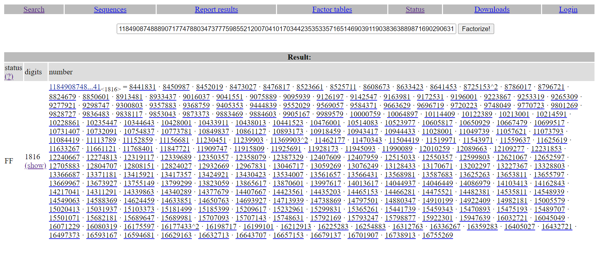

# GlacierCTF 2023

[](https://github.com/Daysapro) [](https://github.com/Daysapro/cryptonomicon)

[]() []() []() []()

> **24/11/2023 19:00 CET - 26/11/2023 19:00 CET**

Todo el código desarrollado se puede consultar en la carpeta de scripts.


## ARISAI

> **213/831 soluciones | 50 puntos**

**Enunciado**

    I heard that RSA with multiple primes is more secure. My N is very large, so there should not be a problem.

**Archivos**

    chall.py

```python
from Crypto.Util.number import bytes_to_long
from Crypto.Util.number import getPrime

PRIME_LENGTH = 24
NUM_PRIMES = 256

FLAG = b"gctf{redacted}"

N = 1
e = 65537

for i in range(NUM_PRIMES):
    prime = getPrime(PRIME_LENGTH)
    N *= prime

ct = pow(bytes_to_long(FLAG), e, N)

print(f"{N=}")
print(f"{e=}")
print(f"{ct=}")
```

    output.txt

```python
N=1184908748889071774788034737775985521200704101703442353533571651469039119038363889871690290631780514392998940707556520304994251661487952739548636064794593979743960985105714178256254882281217858250862223543439960706396290227277478129176832127123978750828494876903409727762030036738239667368905104438928911566884429794089785359693581516505306703816625771477479791983463382338322851370493663626725244651132237909443116453288042969721313548822734328099261670264015661317332067465328436010383015204012585652642998962413149192518150858822735406696105372552184840669950255731733251466001814530877075818908809387881715924209232067963931299295012877100632316050826276879774867425832387424978221636157426227764972761357957047150626791204295493153062565652892972581618176577163744310556692610510074992218502075083140232623713873241177386817247671528165164472947992350655138814891455499972562301161585763970067635688236798480514440398603568227283629452476242623289661524243073929894099518473939222881149459574426407208658860251686137960952889074096311126991477096465624470265619377139983649503903820480974951491378311837933293607705488991162022547957926530402988912221198282579794590930661493745233069145707902854299501706154802038942258911515981663207152069613126155243024789689987554767962281273345273757236723762684230158310314189489269922058062081424352003908442430243686562569467793068370441732743572240164014190275463904986105758545036928880621165599686076511511089276388190078187849622221351011692443859919384379432387437072419707649486293684966456033518855679391672980173280496419686363359529398834403906418139786395934302273747490127295066208248715874656180233559644161531014137838623558729789331274400542717269108353265885948166102045041669627782992845494987948783304254174326130201166965174477449798721151991240203641
e=65537
ct=268829805459609475588440899873097740407996768854076329496002425282199615879909227647380967635165606878898541606457683227761652305836586321855100255485305118037701500609605019785162541750877335573032359895573772603246111506991979320486028250721513277767642375361127152574528694298160906073442383962020636918610527024050576972769852306021296823499884948279413653216802756618690182635446020844210831886652986287932378470425746444631963933610367607515800649608436183004088441881238148504635598468243968695248287570279766119573944421327504565309861792437849662128566261080923059583840204287527201636471106753069738472306223410300379312983945939043519755909420737707495224846116170095923898104488099329762265149868062693687303917610957104520999978944379566136253252697346935036425206126213766976582551430726756840294537354912787885103742021813054656962241068550049435394355553796824094853195888610994254949530524531633088750916669188277025883371307926545593346345011181011886157628805587723572874545440223921942144548540109099572715194182349314576321627183804149379561322969725485272107142991680959335537127382716195040449341448266408777436145121388591741613272241408064729715121476227737259932422493622000014673154665474739974557976672498027364986075870354093242809763072555932073688776712239151696700128393589329790478951588551070833013708885416360627613835550721939073618725634813608997025047929327270234611128029339388251117036658410438813874667672407000490721438737857471847655487642835059784967516451098631494261100960513521722400650533821661854325599281416744189966724295645707952292786069145361070873245192529272080607536319284389065418040578100669665069777133031446812281199863684982910055858515634879595144557407925298026899908970790756383369461817536923660051327566555421265363733995050644914554395836353253513
```


### Resolución

Es un cifrado [RSA](https://en.wikipedia.org/wiki/RSA_(cryptosystem)) en el que el módulo $n$ está compuesto por 256 primos de 24 bits de longitud cada uno. Por la corta longitud de los primos el módulo es fácilmente factorizable por herramientas como [factordb](http://factordb.com/).

<p align="center">
     
</p>

Según la teoría de RSA, si $n$ es factorizable se puede deducir fácilmente el valor de la [función de Euler](https://en.wikipedia.org/wiki/Euler%27s_totient_function) $\phi(n)$. Cuando $n$ está formado por dos primos $p$ y $q$ distintos:

$$\phi(n) = (p - 1) \cdot (q - 1)$$

$$d \cdot e \equiv 1 \bmod \phi(n)$$

Sin embargo, está formado por muchos primos y varios de ellos son iguales, por lo que se necesita usar una expresión más general que la función de Euler. La forma más simple es sustituir la primera aparición de cada primo por ese primo menos uno, y dejar la segunda y siguientes con el propio primo. Así:

$$p = q$$

$$r = s$$

$$p \neq r$$

$$\phi(n) = (p - 1) \cdot q \cdot (r - 1) \cdot s$$

$$d \cdot e \equiv 1 \bmod ((p - 1) \cdot q \cdot (r - 1) \cdot s)$$

Por lo que se calcula $\phi(n)$ según esa expresión y se deriva $d$ como $d \equiv e^{-1} \bmod \phi(n)$.


```python
from factordb.factordb import FactorDB
from Crypto.Util.number import long_to_bytes


N=1184908748889071774788034737775985521200704101703442353533571651469039119038363889871690290631780514392998940707556520304994251661487952739548636064794593979743960985105714178256254882281217858250862223543439960706396290227277478129176832127123978750828494876903409727762030036738239667368905104438928911566884429794089785359693581516505306703816625771477479791983463382338322851370493663626725244651132237909443116453288042969721313548822734328099261670264015661317332067465328436010383015204012585652642998962413149192518150858822735406696105372552184840669950255731733251466001814530877075818908809387881715924209232067963931299295012877100632316050826276879774867425832387424978221636157426227764972761357957047150626791204295493153062565652892972581618176577163744310556692610510074992218502075083140232623713873241177386817247671528165164472947992350655138814891455499972562301161585763970067635688236798480514440398603568227283629452476242623289661524243073929894099518473939222881149459574426407208658860251686137960952889074096311126991477096465624470265619377139983649503903820480974951491378311837933293607705488991162022547957926530402988912221198282579794590930661493745233069145707902854299501706154802038942258911515981663207152069613126155243024789689987554767962281273345273757236723762684230158310314189489269922058062081424352003908442430243686562569467793068370441732743572240164014190275463904986105758545036928880621165599686076511511089276388190078187849622221351011692443859919384379432387437072419707649486293684966456033518855679391672980173280496419686363359529398834403906418139786395934302273747490127295066208248715874656180233559644161531014137838623558729789331274400542717269108353265885948166102045041669627782992845494987948783304254174326130201166965174477449798721151991240203641
e=65537
ct=268829805459609475588440899873097740407996768854076329496002425282199615879909227647380967635165606878898541606457683227761652305836586321855100255485305118037701500609605019785162541750877335573032359895573772603246111506991979320486028250721513277767642375361127152574528694298160906073442383962020636918610527024050576972769852306021296823499884948279413653216802756618690182635446020844210831886652986287932378470425746444631963933610367607515800649608436183004088441881238148504635598468243968695248287570279766119573944421327504565309861792437849662128566261080923059583840204287527201636471106753069738472306223410300379312983945939043519755909420737707495224846116170095923898104488099329762265149868062693687303917610957104520999978944379566136253252697346935036425206126213766976582551430726756840294537354912787885103742021813054656962241068550049435394355553796824094853195888610994254949530524531633088750916669188277025883371307926545593346345011181011886157628805587723572874545440223921942144548540109099572715194182349314576321627183804149379561322969725485272107142991680959335537127382716195040449341448266408777436145121388591741613272241408064729715121476227737259932422493622000014673154665474739974557976672498027364986075870354093242809763072555932073688776712239151696700128393589329790478951588551070833013708885416360627613835550721939073618725634813608997025047929327270234611128029339388251117036658410438813874667672407000490721438737857471847655487642835059784967516451098631494261100960513521722400650533821661854325599281416744189966724295645707952292786069145361070873245192529272080607536319284389065418040578100669665069777133031446812281199863684982910055858515634879595144557407925298026899908970790756383369461817536923660051327566555421265363733995050644914554395836353253513


f = FactorDB(N)
f.connect()

phi = 1
primes = f.get_factor_list()
duplicates = [x for x in primes if primes.count(x) > 1]
duplicates_flag = [True] * len(duplicates)

for prime in primes:
    if prime in duplicates and duplicates_flag[duplicates.index(prime)]:
        phi *= (prime - 1)
        phi *= prime
        duplicates_flag[duplicates.index(prime)] = False
    elif prime not in duplicates:
        phi *= (prime - 1)

d = pow(e, -1, phi)
assert d * e % phi == 1

print(long_to_bytes(pow(ct, d, N)))
```

> **flag: gctf{maybe_I_should_have_used_bigger_primes}**


## Missing Bits

> **136/831 soluciones | 50 puntos**

**Enunciado**

    Somehow your private key lost some bits. Are you able to reconstruct them and decrypt the ciphertext?

**Archivos**

    encode_file.py

```python
from Crypto.PublicKey import RSA
from Crypto.Util.number import bytes_to_long
from Crypto.Util.number import long_to_bytes

content = open("2048_key_original.priv", "rb").read()
key = RSA.import_key(content)

filecontent = open("plaintext_message", "rb").read()

ct = pow(bytes_to_long(filecontent), key.e, key.n)

open("ciphertext_message", "wb").write(long_to_bytes(ct))
```

    priv.key

```python
                                                                
                                                                
                                                                
                                                                
                                                                
                                                                
xwiBgUBTtaSyUvdrqfgAEduRdnzRbKcwEheMxwIDAQABAoIBAAqaJbojNCwYqykz
n0Fn2sxMsho4PhThPQcX79AGqSxVNxviWK2GXETP7SsnvWGmRXHIRnR6JGOhyHVe
dTDYZxOAOhl85FksVQYVUaygf9Epekja/vSj5OE8NIcAdEBr3aZ6gdLxi+q1a5Kh
1nEmsF6FiYGpsPkN63ovbow/CKt4N7UQJqZEQw380rNA0sOQenmzXRFOpXA8PRFb
G6itGRiP1gB9tpdQnWggQ5n+x8/2k+k3CRW6/xIP9dMAVZh2jVombenLxgnhQCJB
bYaR4I8B0zzYqXqFfeHCMNl+pJmmmFcvs2ZE71fqyjRid6ZDqS4GXtSuRQM0UL7L
UQVBaYECgYEA5BiLN7FjwgOuT4FKxFdzizdq/t5mvRksbmBP/JWk3vxQYeCmMiPQ
xrQUqdHGGxG8iMIwH7dnhNaPa81lrP9fCKyij/caEbe4lmEm+VdM/xZQF+PiCc1f
ziYXphz9wuAc8++kvKxM2EaiDe8F25nsXW+FaxNoXKbJg0zTQLyzKiECgYEA8SLi
hbAwo2l0zal8GMIemzr+APxLw+fmd4aryVAMov8ANkG8KDMwdmvvkn3rL7WaKym5
fakqvXR45/QGPe8niVzx6oaWGSSfijeVan27pG/bzVqyymFHZP9cRhEHW4HN57hO
pXy0kUFqVaxJWCs+thH0LTZoToAepg+sr82FaecCgYEAnJnpQzRsHDEwxO8sqP6t
moBS2mdRPDUDV0iSwgTvrBSpD3oQQM5sMXBD24/lpoIX4gEIz025Ke+xij77trmh
wq/b8GGjqVRsy/opqvjwKRZlqPFRKI+zXjKy+95dryT1W9lFTjAxli9wZYaci/fy
2veNL0Wk2i+8nIPraj/j9mECgYEA0ou6LC7OGTDwKs7sqxV78eBNfoDMis7GPeEZ
x9ocXom3HqjA6HzhuNS/xzIpE2xGo5939c+qoOe81hMNDDDwXZEJLdS75FJE90NX
NDd6iracvi6OZAUSeI47fHZL7UtmhQg5q2c6poXumcWn+NMxm3oLsRqLcteNa0PO
bWZPMksCgYBidblknACvEinDUQB8dvElzROql0ZUMX9hQOsSrg0ju3smun8qujcT
PJQrWctoNw0ZXnQjDkVzaJxog1F3QkKUg6B1Rn2Q0RYuCAeNDn+KqBkTT18Du7yw
+GU/4U6EMw+uL7dNjasD1jjx90ro6RmDDBmGDQuludO0G7h9XQzl+Q==
-----END RSA PRIVATE KEY-----
```

    ciphertext_message

```python
Fichero cifrado.
```


### Resolución

Nos propocionan una clave privada parcial y un mensaje cifrado con esa clave.

Las claves RSA en [formato PEM](https://en.wikipedia.org/wiki/Privacy-Enhanced_Mail) utilizan el estándar [ASN.1](https://en.wikipedia.org/wiki/ASN.1) y las reglas de codificación [DER](https://en.wikipedia.org/wiki/X.690#DER_encoding) para almacenar la información pública y privada de las claves criptográficas.

La estructura de una clave privada RSA en ASN.1 es:

```
RSAPrivateKey ::= SEQUENCE {
      version   Version,
      modulus   INTEGER,  -- n
      publicExponentINTEGER,  -- e
      privateExponent   INTEGER,  -- d
      prime1 INTEGER,  -- p
      prime2 INTEGER,  -- q
      exponent1 INTEGER,  -- d mod (p-1)
      exponent2 INTEGER,  -- d mod (q-1)
      coefficient   INTEGER,  -- (inverse of q) mod p
      otherPrimeInfos   OtherPrimeInfos OPTIONAL
    }
```

Estos valores en la clave están divididos por la cadena hexadecimal ```028181```, el ```02``` indicando que el parámetro es un entero y el ```8181``` su longitud.

La información en hexadecimal de la clave parcial dada por el ejercicio es:

```
c70881814053b5a4b252f76ba9f80011db91767cd16ca73012178cc70203010001
028201000a9a25ba23342c18ab29339f4167dacc4cb21a383e14e13d0717efd006 <-
a92c55371be258ad865c44cfed2b27bd61a64571c846747a2463a1c8755e7530d8
6713803a197ce4592c55061551aca07fd1297a48dafef4a3e4e13c34870074406b
dda67a81d2f18beab56b92a1d67126b05e858981a9b0f90deb7a2f6e8c3f08ab78
37b51026a644430dfcd2b340d2c3907a79b35d114ea5703c3d115b1ba8ad19188f
d6007db697509d68204399fec7cff693e9370915baff120ff5d3005598768d5a26
6de9cbc609e14022416d8691e08f01d33cd8a97a857de1c230d97ea499a698572f
b36644ef57eaca346277a643a92e065ed4ae45033450becb510541698102818100 <-
e4188b37b163c203ae4f814ac457738b376afede66bd192c6e604ffc95a4defc50
61e0a63223d0c6b414a9d1c61b11bc88c2301fb76784d68f6bcd65acff5f08aca2
8ff71a11b7b8966126f9574cff165017e3e209cd5fce2617a61cfdc2e01cf3efa4
bcac4cd846a20def05db99ec5d6f856b13685ca6c9834cd340bcb32a2102818100 <-
f122e285b030a36974cda97c18c21e9b3afe00fc4bc3e7e67786abc9500ca2ff00
3641bc283330766bef927deb2fb59a2b29b97da92abd7478e7f4063def27895cf1
ea869619249f8a37956a7dbba46fdbcd5ab2ca614764ff5c4611075b81cde7b84e
a57cb491416a55ac49582b3eb611f42d36684e801ea60facafcd8569e702818100 <-
9c99e943346c1c3130c4ef2ca8fead9a8052da67513c3503574892c204efac14a9
0f7a1040ce6c317043db8fe5a68217e20108cf4db929efb18a3efbb6b9a1c2afdb
f061a3a9546ccbfa29aaf8f0291665a8f151288fb35e32b2fbde5daf24f55bd945
4e3031962f7065869c8bf7f2daf78d2f45a4da2fbc9c83eb6a3fe3f66102818100 <-
d28bba2c2ece1930f02aceecab157bf1e04d7e80cc8acec63de119c7da1c5e89b7
1ea8c0e87ce1b8d4bfc73229136c46a39f77f5cfaaa0e7bcd6130d0c30f05d9109
2dd4bbe45244f7435734377a8ab69cbe2e8e640512788e3b7c764bed4b66850839
ab673aa685ee99c5a7f8d3319b7a0bb11a8b72d78d6b43ce6d664f324b02818062 <-
75b9649c00af1229c351007c76f125cd13aa974654317f6140eb12ae0d23bb7b26
ba7f2aba37133c942b59cb68370d195e74230e4573689c6883517742429483a075
467d90d1162e08078d0e7f8aa819134f5f03bbbcb0f8653fe14e84330fae2fb74d
8dab03d638f1f74ae8e919830c19860d0ba5b9d3b41bb87d5d0ce5f9
```

En el inicio de la primera línea señalada se puede ver la cadena ```028201```, que indica el inicio de la clave privada $d$. Se puede llegar a esa conclusión viendo que los valores que le preceden son ```10001```, 65537 en decimal, [primo de Fermat](https://en.wikipedia.org/wiki/Fermat_number) y clave pública $e$ muy común en los sistemas de clave RSA. ```020301``` es la cadena que señala tipo y longitud de este parámetro.

Ya situados extraemos los valores siguiendo la estructura de ASN.1. $n$ no se encuentra dentro de la clave parcial, pero una vez recuperados $p$ y $q$ podemos calcularla y leer el mensaje cifrado.

```python
from Crypto.Util.number import bytes_to_long, long_to_bytes
from base64 import b64decode


private_key = b"""xwiBgUBTtaSyUvdrqfgAEduRdnzRbKcwEheMxwIDAQABAoIBAAqaJbojNCwYqykz
n0Fn2sxMsho4PhThPQcX79AGqSxVNxviWK2GXETP7SsnvWGmRXHIRnR6JGOhyHVe
dTDYZxOAOhl85FksVQYVUaygf9Epekja/vSj5OE8NIcAdEBr3aZ6gdLxi+q1a5Kh
1nEmsF6FiYGpsPkN63ovbow/CKt4N7UQJqZEQw380rNA0sOQenmzXRFOpXA8PRFb
G6itGRiP1gB9tpdQnWggQ5n+x8/2k+k3CRW6/xIP9dMAVZh2jVombenLxgnhQCJB
bYaR4I8B0zzYqXqFfeHCMNl+pJmmmFcvs2ZE71fqyjRid6ZDqS4GXtSuRQM0UL7L
UQVBaYECgYEA5BiLN7FjwgOuT4FKxFdzizdq/t5mvRksbmBP/JWk3vxQYeCmMiPQ
xrQUqdHGGxG8iMIwH7dnhNaPa81lrP9fCKyij/caEbe4lmEm+VdM/xZQF+PiCc1f
ziYXphz9wuAc8++kvKxM2EaiDe8F25nsXW+FaxNoXKbJg0zTQLyzKiECgYEA8SLi
hbAwo2l0zal8GMIemzr+APxLw+fmd4aryVAMov8ANkG8KDMwdmvvkn3rL7WaKym5
fakqvXR45/QGPe8niVzx6oaWGSSfijeVan27pG/bzVqyymFHZP9cRhEHW4HN57hO
pXy0kUFqVaxJWCs+thH0LTZoToAepg+sr82FaecCgYEAnJnpQzRsHDEwxO8sqP6t
moBS2mdRPDUDV0iSwgTvrBSpD3oQQM5sMXBD24/lpoIX4gEIz025Ke+xij77trmh
wq/b8GGjqVRsy/opqvjwKRZlqPFRKI+zXjKy+95dryT1W9lFTjAxli9wZYaci/fy
2veNL0Wk2i+8nIPraj/j9mECgYEA0ou6LC7OGTDwKs7sqxV78eBNfoDMis7GPeEZ
x9ocXom3HqjA6HzhuNS/xzIpE2xGo5939c+qoOe81hMNDDDwXZEJLdS75FJE90NX
NDd6iracvi6OZAUSeI47fHZL7UtmhQg5q2c6poXumcWn+NMxm3oLsRqLcteNa0PO
bWZPMksCgYBidblknACvEinDUQB8dvElzROql0ZUMX9hQOsSrg0ju3smun8qujcT
PJQrWctoNw0ZXnQjDkVzaJxog1F3QkKUg6B1Rn2Q0RYuCAeNDn+KqBkTT18Du7yw
+GU/4U6EMw+uL7dNjasD1jjx90ro6RmDDBmGDQuludO0G7h9XQzl+Q=="""

print(hex(bytes_to_long(b64decode(private_key))))

p = 0xe4188b37b163c203ae4f814ac457738b376afede66bd192c6e604ffc95a4defc5061e0a63223d0c6b414a9d1c61b11bc88c2301fb76784d68f6bcd65acff5f08aca28ff71a11b7b8966126f9574cff165017e3e209cd5fce2617a61cfdc2e01cf3efa4bcac4cd846a20def05db99ec5d6f856b13685ca6c9834cd340bcb32a21
q = 0xf122e285b030a36974cda97c18c21e9b3afe00fc4bc3e7e67786abc9500ca2ff003641bc283330766bef927deb2fb59a2b29b97da92abd7478e7f4063def27895cf1ea869619249f8a37956a7dbba46fdbcd5ab2ca614764ff5c4611075b81cde7b84ea57cb491416a55ac49582b3eb611f42d36684e801ea60facafcd8569e7
d = 0xa9a25ba23342c18ab29339f4167dacc4cb21a383e14e13d0717efd006a92c55371be258ad865c44cfed2b27bd61a64571c846747a2463a1c8755e7530d86713803a197ce4592c55061551aca07fd1297a48dafef4a3e4e13c34870074406bdda67a81d2f18beab56b92a1d67126b05e858981a9b0f90deb7a2f6e8c3f08ab7837b51026a644430dfcd2b340d2c3907a79b35d114ea5703c3d115b1ba8ad19188fd6007db697509d68204399fec7cff693e9370915baff120ff5d3005598768d5a266de9cbc609e14022416d8691e08f01d33cd8a97a857de1c230d97ea499a698572fb36644ef57eaca346277a643a92e065ed4ae45033450becb5105416981

n = p * q
phi = (p - 1) * (q - 1)


with open("ciphertext_message", 'rb') as file:
    print(long_to_bytes(pow(bytes_to_long(file.read()), d, n)))
```

> **flag: gctf{7hi5_k3y_can_b3_r3c0ns7ruc7ed}**


## SLCG

> **87/831 soluciones | 50 puntos**

**Enunciado**

    In cryptography class we learned about random numbers and algorithms to create pseudo random number generators. I think I build a solid cipher that nobody can break. This is why I call it SecureLongCiphertextGenerator, SLCG for short

**Archivos**

    encrypt.py

```python
from __future__ import annotations

import os

FLAG = b"gctf{???????}"


class LCG:
    def __init__(self, mod: int, mult: int, add: int, seed: int):
        self.mod = mod
        self.mult = mult
        self.add = add
        self.value = seed

    def __next__(self) -> int:
        self.value = (self.value * self.mult + self.add) % self.mod
        return self.value

    def __iter__(self) -> LCG:
        return self

    @classmethod
    def random_values(cls):
        return LCG(
            int.from_bytes(os.urandom(16)),
            int.from_bytes(os.urandom(16)),
            int.from_bytes(os.urandom(16)),
            int.from_bytes(os.urandom(16))
        )


class Encryptor:
    def __init__(self):
        self.lcgs: tuple[LCG] = (LCG.random_values(), LCG.random_values())

    def encrypt(self, message: str) -> list[int]:
        result = []
        for ascii_char in message:
            bin_char = list(map(int, list(f"{ascii_char:07b}")))

            for bit in bin_char:
                result.append(next(self.lcgs[bit]))

            self.lcgs = (
                LCG(
                    next(self.lcgs[0]), next(self.lcgs[0]),
                    next(self.lcgs[0]), next(self.lcgs[0])
                ),
                LCG(
                    next(self.lcgs[1]), next(self.lcgs[1]),
                    next(self.lcgs[1]), next(self.lcgs[1])
                )
            )
        return result


def main() -> int:
    encryption = Encryptor()
    print(f"ct = {encryption.encrypt(FLAG)}")

    return 0


if __name__ == "__main__":
    raise SystemExit(main())
```

    ciphertext.txt

```python
ct = [114293481651692805418121538415147589604, 54633022358060826155954146262572096344, 39246964755280114087344695441503859529, 703463377822278186043454332542885631, 125313023815946519926697407430683658442, 162960109688532363602735593403961340669, 169104787290291550198916185039818769417, 13372371689034608934042109259651932913, 51422260128019952349405691786844709461, 1051777155079167180002756329036502707, 15923116890164513335569368667703873, 971358536846996655674257654714172515, 25204581825024414471206078194323632214, 23500231184211815510804184187742001447, 2379381023229713239273408997788051784, 2879885915245668425181114446703811854, 3112702453712052233092578707053087554, 927669813382289621755794625268082452, 834433535584809394710922489203298074, 313563733833157852430102794396702787, 944323926949619412414979250796256793, 91717176861821570143294495808173674, 52491683375438185937328405118585970, 562902158889616768851916729259322760, 239097371607957075191287752287148847, 76238022626131454651591457135092138, 289425170380755779854486501977374546, 313519669607689910328667862844315309, 577829319421425064009918698244993630, 505266435119561487868754134859795702, 759859325586953800596818729729968722, 512690647196804023738947989498910204, 346213412899815521402585882290927207, 155499553397124669610409568175991478, 178390908143993770691473011050263374, 730336353049705201033505573335004552, 401038838861799443381259276896411192, 62522802402325448639454211180743836, 70128026993853587348178136285880714, 270468171896930680168562773476062156, 68944207631401982741949386410868354, 28794858681066468291931415836050596, 286663035287217594499906865137515456, 80718253243276206845249853209869454, 3713837217262237612874018016540336, 16488192370707544847317466186135748, 18062417034061094139089752173392122, 11726156020588650726051853953493216, 29952876407456039971662622592963770, 3951468417125234262710756483314205, 6108256686951010608427678500763840, 409614211632056397738470299915802922, 10118836381453913641380092261871566, 8507726865358444591886502030371909, 9619191946874532625727888255615201, 15529371542565664478385146600546754, 1008012615212795231596672240458771, 73002819916955035882118301875217962, 30322792298255259533193879184197360, 3237272104826256109796281336359491, 58806057979702216159853067957716050, 3327978693457064603095094817246651, 1615805105431371848642733130622244, 818457227439045512790497438622154, 5972870434531768792652747902651134, 1242737596703142269806832363864512, 347239827113107915669856462892022, 916248999816087150057401289833332, 165324305795703078802760600379826, 761731111183586921956651131746044, 420351026458229547525207185078820, 304635165087495732525613546708632, 578977321829565725347207857967728, 588127506536690546582158996485984, 130723651010817052114717758815500, 275734025095575498716310084308847, 841649218923857866841085634620309, 134794772662902356787697693365952, 113739428144824653226812792446444, 167103543150235445151294738487632, 13678906989659363088885602833314, 219886167313326359012780093710434, 179670727571406710686294764564320, 87553053686788602106947680417328, 121346915154929063084499394911984, 73610558587305253963595572076688, 264843071386553232214831288822116, 263375982050650870882508171894940, 32143293135200986736837640555552, 4863003162724954666690441679832, 86217380664331186252079713772664, 88904528544401948757481819201188, 241083969053441690393801131202832, 94183119121761838397597054123844, 101674656104514000121636172713332, 73432121862125830297974492411036, 64932946798081207082668868567988, 11961507214749622294953115845984, 99544098028512176660075181295044, 21286714514384781858804074790948, 2802032573287323810961943394264, 130087061021929078261104064220244, 284415927669169792485482454773964, 36486481569720335705902443060132, 36915977762968309748107432531596, 26229488956795828947796518864096, 11538628889884650064079151465168, 48241435563761216190059317613172, 7882288795792666082008690694064, 11185134920196863412131291887776, 27348181613012074399762539616848, 55558482807789571556957861434188, 15665985561344401718910820211328, 20952631219593681266001816455136, 1823094348846890558373425826528, 11169268147922225928017490780072, 15232100405145960599038998229344, 5841431385219110239861840854624, 9694236872806463066167619735040, 3191776518269613652238653442496, 11220188175493529131161798959808, 13629306480523758013430579713344, 11293092669376026975512114123664, 813938876156049395174969332752, 6413568281600142434084122449024, 14218873152545145295490962182960, 2646923460169868062713745139232, 4982881421826289014576775626240, 1942587487831279209136663620096, 4757406824331719321080938290208, 5155982764900971654036997905696, 8996351637294912636513532680768, 3776246323021949501883635259552, 2940742362032162606816569758240, 3439097086893626651084849382048, 5443491360207960320552054428896, 152934822599001464362826076192, 146266593339492149764754557440, 100896110532442028928061708272, 204430400033486968386903175632, 19076544675405075275422328304, 1476591481902400835117860574784, 136708629859754503576693801056, 422139194402161576934942579376, 2660870374303248688937023150560, 3499521751230910070902254849600, 3419138564705114474763144860640, 128906026540747262619327214560, 347809648425114846051515361312, 373398730133200815475220586336, 45791014111269931111954971456, 98158330018070604450054839088, 32203165552656756592666135248, 444860266890086213265586095840, 21335492788882169791885761024, 191233906645404038483377604448, 111179721759564963452368440096, 21228401214758039410384347312, 4618774005119592546622967280, 7445481763570808502883560768, 13331302146719807014972421136, 15957110172481929754491523104, 31902687175058950950671035680, 6071576637917064812078775312, 28994458433876328634956947232, 29602108412678606387074585632, 31136297181167291968259143200, 4377061609401537595150092720, 18739088262758069747508512160, 1697215374897177611503935216, 9991995150615182264253554784, 27275896277939620125032049216, 35323266323148568870945194432, 35705457138464438746004892000, 21418454208738578379900440544, 15610538334664622361209750784, 11983129630865266305673245312, 4751133203942822675615823648, 1504344887532686254350315168, 6871456202899194825550654176, 12482775371851112838372797088, 16148909733935812384094647488, 301820234829397006027359744, 179515152912681501914785248, 570327849912535705153370592, 369221247757843820408161440, 132466460753886294319653600, 22155315333130772552601504, 147739587342961290572487456, 18434258669507552995118688, 14902050119637183064265088, 14663565206222549091928992, 83566333140801926129829216, 182902810872058016388181344, 12320743139935718308083648, 17407711863986253248378016, 18054228258971038767989664, 10145795613011605088476704, 70122761346018924538011072, 507206557111633694685216, 13434332134738626922966848, 16478829090109411285851360, 43289158667652071857724832, 11287909012552826990886144, 6803125004639592520170048, 4148700224926893076270368, 697270791918553121360448, 6175696471191324604916928, 7210370598960718221566688, 4059762162428611940228928, 3727724334198460109258976, 10839231460482685972731936, 1294528907758485509843040, 570763929228578395722720, 1526284916065825791299424, 4078018803752278681953888, 1387747355450504633167968, 121667390912716438204800, 279402896646991436612832, 70491292887529038948192, 364022339518764603333216, 1517848441376541151929408, 275799208478701380869088, 342037868066698381278624, 5239939805548865636560992, 88820710527726344037024, 38276815978085386141440, 3732532266048490230721920, 6364130886328972839145056, 2185726294522308965410368, 5691527035619341958731872, 12723981342565559840928, 127793683146336082192800, 36352497860287615724256, 100928923891168362564960, 43519383964501288750368, 44740302764523558036768, 68469510949331922482976, 432221721769068279289920, 69537201634054651631904, 23098983498213417194400, 488932246134880550283456, 62591932353807071484192, 3065399212098546993684672, 50717127409858033873056, 23445113825124779999904, 2473864736185555640928, 21562990615047293618976, 3743854691337964567679616, 3933965387355303853296576, 22915805740103037107808, 22809182381128085763744, 1176615007757043884761536, 3312150909413221969632, 7921216705871171191104, 2975969574211957404911424, 2376524313512238367195200, 5925340470077421912288, 7091662260735571071168, 7137860161330251039456, 506450172496669698528, 548504735750623236356352, 357925904073528987591360, 402798372707125404438912, 7586463558208026159360, 7859808314391962196576, 3770059969469476178496, 36886896474868927872, 1045576281168912366720, 433848929689860471360, 1979181152593775178048, 47158321693749302998080, 3245890009539555721728, 1392232548129352376832, 1434446052649400343168, 1763457293898986406336, 7023363386178753730368, 41897416281473804042880, 861563238833929040640, 2005070816980905250752, 3389988855841313136768, 308177334270302156352, 600392179437953740992, 1693096926216397297344, 486042234462699699456, 309404024536209615936, 606855056954616949248, 17419361311898973504, 474919461789271785216, 28000588215675886272, 2723947356985259328, 4461639227509597056, 265922676257769558720, 214372950706606595904, 33383871019763111232, 17705249320245423552, 549865274091688884672, 36844128609151167360, 370137264524363097216, 451598930852828980032, 27272157269714368704, 54781155788543864064, 24770781581091416640, 525051359906128368768, 309016571846670821952, 3494824844200506432, 21775785516948576960, 2648712030327546624, 15301475659865767680, 36977119316788565376, 21627728497884358080, 87435619420004061696, 47063390462185027392, 108640324483640449920, 5380411831211180736, 25933983480398097216, 52526171078188581312, 8218301158282235328, 82664328890028223296, 77395400937614765376, 31914313836549084864, 5674669006127381568, 6443792779765904640, 16022911883239622592, 4275041973814225152, 75025908130106566080, 71541202982849308800, 600699981666109248, 52943936593263053184, 14077712390600339712, 16105722409370135808, 12940327033590648384, 9998251257061178496, 2744484385998979008, 5692393054107809280, 1430438408657197632, 22363824254423512896, 800361609633831168, 5245390673512577280, 3460854991000986432, 8207885334172753152, 10131021590581584000, 17688417915784875840, 395539410746075904, 889655849165825280, 456846656890853376, 2267940394295186688, 729379744944060672, 291788040218266368, 14960706674216268672, 375064819498220544, 882850425329359872, 4625063492831324928, 232341644167928064, 384530928881476608, 1116985437963360000, 3751180509040683264, 58637696311256832, 240902928711954432, 230671930915464192, 42232583219726592, 457038486803872512, 1160326914127210368, 217832909060777472]
```


### Resolución

Este ejercicio recuerda al [Least Common Genominator? del Google CTF 2023](/writeups/Google_CTF_2023/README.md). El objetivo es recuperar los valores de dos generadores de números pseudoaleatorios [LCG](https://en.wikipedia.org/wiki/Linear_congruential_generator), utilizados para encriptar la flag.

El uso que se da al generador LCG para encriptar es el siguiente:

1. Se convierte la flag a binario.
2. Se inicializan con valores aleatorios los dos generadores LCG.
3. Se recorre el binario de la flag. Si el valor es un 0, se genera un número del primer generador y se introduce en una lista. Si es un 1, el valor introducido será el siguiente número del segundo generador.
4. Al terminar de recorrer cada carácter ASCII de la flag ambos generadores se inicializan con los 4 siguientes valores de sí mismos.

Para saber más de cómo funciona un generador LCG y cómo se rompe ver el writeup del [Google CTF 2023](/writeups/Google_CTF_2023/README.md).

Se sabe que la flag comienza en ```gctf{```, en binario ```01100111 01100011 01110100 01100110 01111011```. Considerando la letra g, en binario ```01100111```, tenemos 5 valores conocidos del segundo generador, al tener 5 unos. Estos valores son suficientes para romper este generador. Romper uno de ellos es suficiente para resolver el ejercicio, ya que los valores que no estén presentes en la sucesión generada por el segundo necesariamente tendrán que haber formado parte del primero.

Antes de romper el generador hay que considerar un punto importante que nos quitó mucho tiempo durante la competición. Como todos los caracteres ASCII en binario comienzan por 0, el creador del ejercicio elimina este 0 y deja cada carácter en 7 bits. Por lo que, para seleccionar los valores de la lista que nos interesaban, se tiene que tener en cuenta que cada letra está representada por 7 bits, no por 8 como sería lo habitual.

La g, en vez de ```01100111```, se representa como ```1100111```. 

Una vez recuperados los parámetros del LCG para la g, se continuan generando valores igual que en el código ```encrypt.py```, comprobando si están o no en la lista de valores que proporciona el ejercicio. Si están se siguen generando sin reiniciar el LCG y querrá decir que la siguiente letra sigue teniendo unos. En caso contrario, se inician de nuevo los parámetros del LCG con los siguientes valores. Se construye una lista de esta forma lo suficientemente grande para cubrir toda la flag y se compara con la lista original.

```python
from Crypto.Util.number import GCD, long_to_bytes


ct = [114293481651692805418121538415147589604, 54633022358060826155954146262572096344, 39246964755280114087344695441503859529, 703463377822278186043454332542885631, 125313023815946519926697407430683658442, 162960109688532363602735593403961340669, 169104787290291550198916185039818769417, 13372371689034608934042109259651932913, 51422260128019952349405691786844709461, 1051777155079167180002756329036502707, 15923116890164513335569368667703873, 971358536846996655674257654714172515, 25204581825024414471206078194323632214, 23500231184211815510804184187742001447, 2379381023229713239273408997788051784, 2879885915245668425181114446703811854, 3112702453712052233092578707053087554, 927669813382289621755794625268082452, 834433535584809394710922489203298074, 313563733833157852430102794396702787, 944323926949619412414979250796256793, 91717176861821570143294495808173674, 52491683375438185937328405118585970, 562902158889616768851916729259322760, 239097371607957075191287752287148847, 76238022626131454651591457135092138, 289425170380755779854486501977374546, 313519669607689910328667862844315309, 577829319421425064009918698244993630, 505266435119561487868754134859795702, 759859325586953800596818729729968722, 512690647196804023738947989498910204, 346213412899815521402585882290927207, 155499553397124669610409568175991478, 178390908143993770691473011050263374, 730336353049705201033505573335004552, 401038838861799443381259276896411192, 62522802402325448639454211180743836, 70128026993853587348178136285880714, 270468171896930680168562773476062156, 68944207631401982741949386410868354, 28794858681066468291931415836050596, 286663035287217594499906865137515456, 80718253243276206845249853209869454, 3713837217262237612874018016540336, 16488192370707544847317466186135748, 18062417034061094139089752173392122, 11726156020588650726051853953493216, 29952876407456039971662622592963770, 3951468417125234262710756483314205, 6108256686951010608427678500763840, 409614211632056397738470299915802922, 10118836381453913641380092261871566, 8507726865358444591886502030371909, 9619191946874532625727888255615201, 15529371542565664478385146600546754, 1008012615212795231596672240458771, 73002819916955035882118301875217962, 30322792298255259533193879184197360, 3237272104826256109796281336359491, 58806057979702216159853067957716050, 3327978693457064603095094817246651, 1615805105431371848642733130622244, 818457227439045512790497438622154, 5972870434531768792652747902651134, 1242737596703142269806832363864512, 347239827113107915669856462892022, 916248999816087150057401289833332, 165324305795703078802760600379826, 761731111183586921956651131746044, 420351026458229547525207185078820, 304635165087495732525613546708632, 578977321829565725347207857967728, 588127506536690546582158996485984, 130723651010817052114717758815500, 275734025095575498716310084308847, 841649218923857866841085634620309, 134794772662902356787697693365952, 113739428144824653226812792446444, 167103543150235445151294738487632, 13678906989659363088885602833314, 219886167313326359012780093710434, 179670727571406710686294764564320, 87553053686788602106947680417328, 121346915154929063084499394911984, 73610558587305253963595572076688, 264843071386553232214831288822116, 263375982050650870882508171894940, 32143293135200986736837640555552, 4863003162724954666690441679832, 86217380664331186252079713772664, 88904528544401948757481819201188, 241083969053441690393801131202832, 94183119121761838397597054123844, 101674656104514000121636172713332, 73432121862125830297974492411036, 64932946798081207082668868567988, 11961507214749622294953115845984, 99544098028512176660075181295044, 21286714514384781858804074790948, 2802032573287323810961943394264, 130087061021929078261104064220244, 284415927669169792485482454773964, 36486481569720335705902443060132, 36915977762968309748107432531596, 26229488956795828947796518864096, 11538628889884650064079151465168, 48241435563761216190059317613172, 7882288795792666082008690694064, 11185134920196863412131291887776, 27348181613012074399762539616848, 55558482807789571556957861434188, 15665985561344401718910820211328, 20952631219593681266001816455136, 1823094348846890558373425826528, 11169268147922225928017490780072, 15232100405145960599038998229344, 5841431385219110239861840854624, 9694236872806463066167619735040, 3191776518269613652238653442496, 11220188175493529131161798959808, 13629306480523758013430579713344, 11293092669376026975512114123664, 813938876156049395174969332752, 6413568281600142434084122449024, 14218873152545145295490962182960, 2646923460169868062713745139232, 4982881421826289014576775626240, 1942587487831279209136663620096, 4757406824331719321080938290208, 5155982764900971654036997905696, 8996351637294912636513532680768, 3776246323021949501883635259552, 2940742362032162606816569758240, 3439097086893626651084849382048, 5443491360207960320552054428896, 152934822599001464362826076192, 146266593339492149764754557440, 100896110532442028928061708272, 204430400033486968386903175632, 19076544675405075275422328304, 1476591481902400835117860574784, 136708629859754503576693801056, 422139194402161576934942579376, 2660870374303248688937023150560, 3499521751230910070902254849600, 3419138564705114474763144860640, 128906026540747262619327214560, 347809648425114846051515361312, 373398730133200815475220586336, 45791014111269931111954971456, 98158330018070604450054839088, 32203165552656756592666135248, 444860266890086213265586095840, 21335492788882169791885761024, 191233906645404038483377604448, 111179721759564963452368440096, 21228401214758039410384347312, 4618774005119592546622967280, 7445481763570808502883560768, 13331302146719807014972421136, 15957110172481929754491523104, 31902687175058950950671035680, 6071576637917064812078775312, 28994458433876328634956947232, 29602108412678606387074585632, 31136297181167291968259143200, 4377061609401537595150092720, 18739088262758069747508512160, 1697215374897177611503935216, 9991995150615182264253554784, 27275896277939620125032049216, 35323266323148568870945194432, 35705457138464438746004892000, 21418454208738578379900440544, 15610538334664622361209750784, 11983129630865266305673245312, 4751133203942822675615823648, 1504344887532686254350315168, 6871456202899194825550654176, 12482775371851112838372797088, 16148909733935812384094647488, 301820234829397006027359744, 179515152912681501914785248, 570327849912535705153370592, 369221247757843820408161440, 132466460753886294319653600, 22155315333130772552601504, 147739587342961290572487456, 18434258669507552995118688, 14902050119637183064265088, 14663565206222549091928992, 83566333140801926129829216, 182902810872058016388181344, 12320743139935718308083648, 17407711863986253248378016, 18054228258971038767989664, 10145795613011605088476704, 70122761346018924538011072, 507206557111633694685216, 13434332134738626922966848, 16478829090109411285851360, 43289158667652071857724832, 11287909012552826990886144, 6803125004639592520170048, 4148700224926893076270368, 697270791918553121360448, 6175696471191324604916928, 7210370598960718221566688, 4059762162428611940228928, 3727724334198460109258976, 10839231460482685972731936, 1294528907758485509843040, 570763929228578395722720, 1526284916065825791299424, 4078018803752278681953888, 1387747355450504633167968, 121667390912716438204800, 279402896646991436612832, 70491292887529038948192, 364022339518764603333216, 1517848441376541151929408, 275799208478701380869088, 342037868066698381278624, 5239939805548865636560992, 88820710527726344037024, 38276815978085386141440, 3732532266048490230721920, 6364130886328972839145056, 2185726294522308965410368, 5691527035619341958731872, 12723981342565559840928, 127793683146336082192800, 36352497860287615724256, 100928923891168362564960, 43519383964501288750368, 44740302764523558036768, 68469510949331922482976, 432221721769068279289920, 69537201634054651631904, 23098983498213417194400, 488932246134880550283456, 62591932353807071484192, 3065399212098546993684672, 50717127409858033873056, 23445113825124779999904, 2473864736185555640928, 21562990615047293618976, 3743854691337964567679616, 3933965387355303853296576, 22915805740103037107808, 22809182381128085763744, 1176615007757043884761536, 3312150909413221969632, 7921216705871171191104, 2975969574211957404911424, 2376524313512238367195200, 5925340470077421912288, 7091662260735571071168, 7137860161330251039456, 506450172496669698528, 548504735750623236356352, 357925904073528987591360, 402798372707125404438912, 7586463558208026159360, 7859808314391962196576, 3770059969469476178496, 36886896474868927872, 1045576281168912366720, 433848929689860471360, 1979181152593775178048, 47158321693749302998080, 3245890009539555721728, 1392232548129352376832, 1434446052649400343168, 1763457293898986406336, 7023363386178753730368, 41897416281473804042880, 861563238833929040640, 2005070816980905250752, 3389988855841313136768, 308177334270302156352, 600392179437953740992, 1693096926216397297344, 486042234462699699456, 309404024536209615936, 606855056954616949248, 17419361311898973504, 474919461789271785216, 28000588215675886272, 2723947356985259328, 4461639227509597056, 265922676257769558720, 214372950706606595904, 33383871019763111232, 17705249320245423552, 549865274091688884672, 36844128609151167360, 370137264524363097216, 451598930852828980032, 27272157269714368704, 54781155788543864064, 24770781581091416640, 525051359906128368768, 309016571846670821952, 3494824844200506432, 21775785516948576960, 2648712030327546624, 15301475659865767680, 36977119316788565376, 21627728497884358080, 87435619420004061696, 47063390462185027392, 108640324483640449920, 5380411831211180736, 25933983480398097216, 52526171078188581312, 8218301158282235328, 82664328890028223296, 77395400937614765376, 31914313836549084864, 5674669006127381568, 6443792779765904640, 16022911883239622592, 4275041973814225152, 75025908130106566080, 71541202982849308800, 600699981666109248, 52943936593263053184, 14077712390600339712, 16105722409370135808, 12940327033590648384, 9998251257061178496, 2744484385998979008, 5692393054107809280, 1430438408657197632, 22363824254423512896, 800361609633831168, 5245390673512577280, 3460854991000986432, 8207885334172753152, 10131021590581584000, 17688417915784875840, 395539410746075904, 889655849165825280, 456846656890853376, 2267940394295186688, 729379744944060672, 291788040218266368, 14960706674216268672, 375064819498220544, 882850425329359872, 4625063492831324928, 232341644167928064, 384530928881476608, 1116985437963360000, 3751180509040683264, 58637696311256832, 240902928711954432, 230671930915464192, 42232583219726592, 457038486803872512, 1160326914127210368, 217832909060777472]

s0 = 114293481651692805418121538415147589604
s1 = 54633022358060826155954146262572096344
s2 = 125313023815946519926697407430683658442
s3 = 162960109688532363602735593403961340669
s4 = 169104787290291550198916185039818769417

n1 = abs((s2 - s1) * (s2 - s0) - (s3 - s1) * (s1 - s0))
n2 = abs((s2 - s1) * (s3 - s0) - (s4 - s1) * (s1 - s0))
n3 = abs((s2 - s1) * (s2 - s1) - (s3 - s2) * (s1 - s0))
n4 = abs((s2 - s1) * (s3 - s1) - (s4 - s2) * (s1 - s0))
n5 = abs((s2 - s1) * (s3 - s2) - (s4 - s3) * (s1 - s0))
n6 = abs((s4 - s3) * (s1 - s0) - (s2 - s1) * (s3 - s2))
n7 = abs((s3 - s1) * (s3 - s2) - (s4 - s3) * (s2 - s0))

mod = GCD(n1, n2, n3, n4, n5, n6, n7)
mult = (s2 - s1) * pow(s1 - s0, -1, mod) % mod
add = (s1 - mult*s0) % mod
assert s1 == (s0*mult + add) % mod

values_lcg = []
value = s0
for i in range(300):
    if value in ct:
        values_lcg.append(value)
    else:
        mod1 = mod
        mult1 = mult
        add1 = add
        mod = value
        mult = (mod * mult1 + add1) % mod1
        add = (mult * mult1 + add1) % mod1
        value = (add * mult1 + add1) % mod1
    value = (value * mult + add) % mod

flag = ""
counter = 0
for value in ct:
    if counter % 7 == 0:
        flag += "0"
    if value in values_lcg:
        flag += "1"
    else:
        flag += "0"
    counter += 1

print(int(flag, 2).to_bytes(len(flag) // 8, byteorder='big'))
```

> **flag: gctf{th15_lcg_3ncryp710n_w4sn7_s0_5s3cur3_aft3r_4ll}**