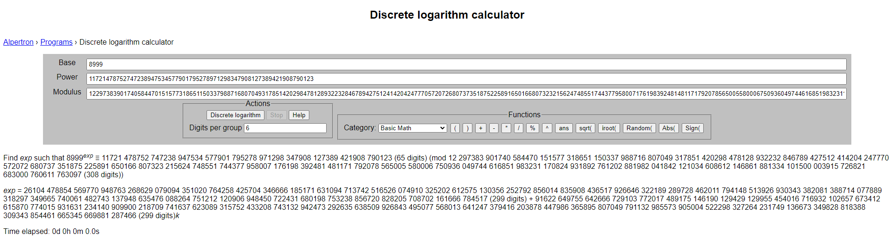

# TJCTF 2023

[](https://github.com/Daysapro) [](https://github.com/Daysapro/cryptonomicon)

[]() []() []() []()

> **26/05/2023 2:00 CEST - 28/05/2023 2:00 CEST**

Todo el código desarrollado se puede consultar en la carpeta de scripts.


## baby-rsa

> **576/1047 soluciones | 6 puntos**

**Enunciado**
    
    small numbers for small messages

**Archivos**

    output.txt

```python
n = 10888751337932558679268839254528888070769213269691871364279830513893837690735136476085167796992556016532860022833558342573454036339582519895539110327482234861870963870144864609120375793020750736090740376786289878349313047032806974605398302398698622431086259032473375162446051603492310000290666366063094482985737032132318650015539702912720882013509099961316767073167848437729826084449943115059234376990825162006299979071912964494228966947974497569783878833130690399504361180345909411669130822346252539746722020515514544334793717997364522192699435604525968953070151642912274210943050922313389271251805397541777241902027
e = 3
c = 2449457955338174702664398437699732241330055959255401949300755756893329242892325068765174475595370736008843435168081093064803408113260941928784442707977000585466461075146434876354981528996602615111767938231799146073229307631775810351487333
```


### Resolución

En el archivo se proporciona el módulo, clave pública y mensaje cifrado resultante de una operación de encriptación del sistema RSA. El enunciado menciona la utilización de números pequeños para mensajes pequeños, haciendo referencia al valor de $e$ utilizado para cifrar el mensaje.

La encriptación en RSA se calcula como $c = m^e \bmod n$. Es trivial suponer que si $m^e < n$, $c = m^e$. Siendo $e = 3$ y nuestro mensaje pequeño, $m =  \sqrt[3]c$.

```python
from sympy.functions.elementary.miscellaneous import cbrt
from Crypto.Util.number import long_to_bytes


n = 10888751337932558679268839254528888070769213269691871364279830513893837690735136476085167796992556016532860022833558342573454036339582519895539110327482234861870963870144864609120375793020750736090740376786289878349313047032806974605398302398698622431086259032473375162446051603492310000290666366063094482985737032132318650015539702912720882013509099961316767073167848437729826084449943115059234376990825162006299979071912964494228966947974497569783878833130690399504361180345909411669130822346252539746722020515514544334793717997364522192699435604525968953070151642912274210943050922313389271251805397541777241902027
e = 3
c = 2449457955338174702664398437699732241330055959255401949300755756893329242892325068765174475595370736008843435168081093064803408113260941928784442707977000585466461075146434876354981528996602615111767938231799146073229307631775810351487333

m = cbrt(c)

print(long_to_bytes(m))
```

> **flag: tjctf{thr33s_4r3_s0_fun_fb23d5ed}**


## ezdlp

> **188/1047 soluciones | 18 puntos**

**Enunciado**
    
    one easy dlp

**Archivos**

    numbers.txt

```python
g = 8999 
s = 11721478752747238947534577901795278971298347908127389421908790123 
p = 12297383901740584470151577318651150337988716807049317851420298478128932232846789427512414204247770572072680737351875225891650166807323215624748551744377958007176198392481481171792078565005580006750936049744616851983231170824931892761202881982041842121034608612146861881334101500003915726821683000760611763097

g^x = s mod p
flag = tjctf{x}
```


### Resolución

Se trata de un logaritmo discreto. Según se explica en la teoría de [Diffie-Hellman](/asymmetric/diffie-hellman/README.md), un logaritmo discreto debe tener parámetros inseguros para que la solución pueda obtenerse. 

Analizando los valores y utilizando la plataforma [factordb](http://factordb.com/index.php) se observa que $p$ no es un número primo, sino un producto de primos de entre 30 y 40 bits. Este fenómeno hace que sea vulnerable a ataques relacionados con la división del grupo en subgrupos más pequeños, ataques conocidos como [ataques de confinamiento de subgrupos pequeños](https://en.wikipedia.org/wiki/Small_subgroup_confinement_attack). 

Esta [herramienta online](https://www.alpertron.com.ar/DILOG.HTM) resuelve el problema.

<p align="center">
     
</p>

El resultado buscado se obtiene con $k = 0$.

> **flag: tjctf{26104478854569770948763268629079094351020764258425704346666185171631094713742516526074910325202612575130356252792856014835908436517926646322189289728462011794148513926930343382081388714077889318297349665740061482743137948635476088264751212120906948450722431680198753238856720828205708702161666784517}**


## iheartrsa

> **106/1047 soluciones | 35 puntos**

**Enunciado**
    
    i sure do love rsa. the question is, do you?
    nc tjc.tf 31628

**Archivos**

    iheartrsa.py

```python
#!/usr/local/bin/python3.10 -u

import ast
import sys

import select
from Crypto.Util import number
import hashlib

with open('flag.txt') as f:
    flag = f.readline()

raw_bin = str(
    bin(int('0x'+str(hashlib.sha256(flag.encode('utf-8')).hexdigest()), 16))[2:])
hsh = int('0b1' + '0' * (256 - len(raw_bin)) + raw_bin, 2)

p = number.getPrime(1024)
q = number.getPrime(1024)
n = p * q
e = 0

for i in range(0, 100):
    if pow(hsh, i) >= n:
        e = i
        break

m = pow(hsh, e, n)
print(f'm: {m}')
print(f'n: {n}')


def input_with_timeout(prompt, timeout):
    sys.stdout.write(prompt)
    sys.stdout.flush()
    ready, _, _ = select.select([sys.stdin], [], [], timeout)
    if ready:
        return sys.stdin.readline().rstrip('\n')
    raise Exception


try:
    answer = input_with_timeout('', 20)
    try:
        answer = ast.literal_eval(answer)
        if hsh == answer:
            print('you love rsa so i <3 you :DD')
            print(flag)
        else:
            print("im upset")
    except Exception as e:
        print("im very upset")
except Exception as e:
    print("\nyou've let me down :(")
```


### Resolución

Tenemos el mensaje cifrado $m$ y el módulo $n$ de un sistema RSA. No conocemos el valor de la clave pública $e$.

El programa calcula el SHA256 de la flag y le añade un bit 1 como el más significativo en su representación binaria. El resultado es una firma que debemos introducir para un mensaje $m$ y módulo $n$ aleatorios, todo dentro de un límite de 20 segundos. 

El envío de un mismo mensaje con diferentes $n$ a $k$ personas puede ser vulnerable al [ataque de difusión Hastad](https://en.wikipedia.org/wiki/Coppersmith%27s_attack) como se verá más adelante. Primero, se debe conocer el valor de $e$.

Calculando los valores máximos y mínimos de $hsh$, $e = 8$ cuando $hsh^e$ pasa a valer igual o más que $n$. Por lo tanto, la clave pública es en todos los casos $e = 8$.

```python
from Crypto.Util import number


p = number.getPrime(1024)
q = number.getPrime(1024)
n = p * q

min_hsh = '0b10000000000000000000000000000000000000000000000000000000000000000000000000000000000000000000000000000000000000000000000000000000000000000000000000000000000000000000000000000000000000000000000000000000000000000000000000000000000000000000000000000000000000000'
min_hsh = 115792089237316195423570985008687907853269984665640564039457584007913129639936
max_hsh = '0b11111111111111111111111111111111111111111111111111111111111111111111111111111111111111111111111111111111111111111111111111111111111111111111111111111111111111111111111111111111111111111111111111111111111111111111111111111111111111111111111111111111111111111'
max_hsh = 231584178474632390847141970017375815706539969331281128078915168015826259279871

assert pow(min_hsh, 7) < n and pow(min_hsh, 8) > n
assert pow(max_hsh, 7) < n and pow(max_hsh, 8) > n
```

El ataque de difusión Hastad se basa en el escenario en que si un emisor envía el mismo mensaje a $k$ personas usando una clave pública pequeña $e$ y diferentes módulos $n$, se necesitan $e$ número de mensajes cifrados para comprometer la seguridad. Por ejemplo, para $e = 3$ Eva intercepta $c_1$, $c_2$ y $c_3$, donde cada $c$ es $c_i \equiv m^3 \bmod n_i$.

$$ c_1 \equiv m^3 \bmod n_1 \rightarrow m^3 \equiv c_1 \bmod n_1$$

$$ c_2 \equiv m^3 \bmod n_2 \rightarrow m^3 \equiv c_2 \bmod n_2$$

$$ c_3 \equiv m^3 \bmod n_3 \rightarrow m^3 \equiv c_3 \bmod n_3$$

Aplicando el [teorema del resto chino](https://en.wikipedia.org/wiki/Chinese_remainder_theorem) podemos encontrar $m^3$, siendo su raíz cúbica el hash buscado.

```python
e = 8
C = []
N = []

for _ in range(e):
    r = remote('tjc.tf', 31628)
    m = int(r.recvline().decode('utf-8').strip()[3:])
    n = int(r.recvline().decode('utf-8').strip()[3:])
    C.append(m)
    N.append(n)

hsh = iroot(crt(N, C)[0], e)

r = remote('tjc.tf', 31628)
r.recvline()
r.recvline()
r.sendline(str(hsh[0]).encode())
print(r.recvall())
```

> **flag: tjctf{iloversaasmuchasilovemymom0xae701ebb}**


## squishy

> **90/1047 soluciones | 42 puntos**

**Enunciado**
    
    sQiShY-sQuIsHy
    nc tjc.tf 31358

**Archivos**

    rsa.py

```python
#!/usr/local/bin/python3.10 -u

import sys
import select
from Crypto.Util.number import bytes_to_long, getPrime


def input_with_timeout(prompt, timeout=10):
    sys.stdout.write(prompt)
    sys.stdout.flush()
    ready, _, _ = select.select([sys.stdin], [], [], timeout)
    if ready:
        return sys.stdin.buffer.readline().rstrip(b'\n')
    raise Exception


def sign(a):
    return pow(bytes_to_long(a), d, n)


def check(a, s):
    return bytes_to_long(a) == pow(s, e, n)


e = 65537
users = {b"admin"}

p = getPrime(1000)
q = getPrime(1000)
n = p * q
d = pow(e, -1, (p - 1) * (q - 1))


print(n)

while True:
    cmd = input("Cmd: ")
    if cmd == "new":
        name = input_with_timeout("Name: ")
        if name not in users:
            users.add(name)
            print(name, sign(name))
        else:
            print("Name taken...")
    elif cmd == "login":
        name = input_with_timeout("Name: ")
        sig = int(input_with_timeout("Sign: ").decode())
        if check(name, sig) and name in users:
            if name == b"admin":
                print("Hey how'd that happen...")
                print(open("flag.txt", "r").read())
            else:
                print("No admin, no flag")
        else:
            print("Invalid login.")

    else:
        print("Command not recognized...")
```


### Resolución

Este ejercicio es un sistema de inicio de sesión en el que se introduce el nombre de usuario y su firma RSA asociada. El objetivo es acceder como el usuario ```admin``` para obtener la flag.

Siendo $m$ el valor numérico de ```admin```, la firma se calcula como: 

$$s \equiv m^d \bmod n$$

Con $n$ y $m$ conocidos.

En esta situación, se puede manipular las peticiones para hacer un ataque del mensaje elegido en la firma RSA.

1. Se selecciona un $m_1$ aleatorio.
2. Se obtiene la firma de $m_1$ con el ```new```: $s_1$.
3. Se calcula un $m_2 = m \cdot m_1^{-1}$, siendo $m$ el valor numérico de ```admin``` y $m_1^{-1}$ el inverso modular de $m_1$ en $n$.
4. Se obtiene la firma de $m_2$ con el ```new```: $s_2$.
5. Se calcula $s$ como:

$$ s_1 \equiv m_1^d \bmod n$$

$$ s_2 \equiv m^d \cdot m_1^{-d} \bmod n$$

$$ s \equiv s_1 \cdot s_2 \bmod n \equiv m_1^d \cdot m^d \cdot m_1^{-d} \bmod n \equiv m^d \bmod n$$

Se utiliza el valor de $s$ para iniciarse sesión como el administrador.

```python
from pwn import *
from Crypto.Util.number import bytes_to_long, long_to_bytes


r = remote('tjc.tf',31358)

n = int(r.recvline().decode('utf-8').strip())
e = 65537

m = b'admin'
m = bytes_to_long(m)

m1 = 7

r.recvuntil(b': ')
r.sendline(b'new')
r.recvuntil(b': ')
r.sendline(long_to_bytes(m1))
s1 = int(r.recvline().split(b' ')[-1].strip())

m2 = m * pow(m1, -1, n) % n

r.recvuntil(b': ')
r.sendline(b'new')
r.recvuntil(b': ')
r.sendline(long_to_bytes(m2))

s2 = int(r.recvline().split(b' ')[-1].strip())

s = (s1 * s2) % n

r.recvuntil(b': ')
r.sendline(b'login')
r.recvuntil(b': ')
r.sendline(long_to_bytes(m))
r.recvline()
r.sendline(long_to_bytes(s))

print(r.recvall())
```

> **flag: tjctf{sQuIsHy-SqUiShY-beansbeansbeans!!!!!!}**


## e

> **64/1047 soluciones | 60 puntos**

**Enunciado**
    
    smol e

**Archivos**

    output.txt

```python
n = 853008036761402960429244085500226305898326229049062709229066738337581395441559298620215547481097485360068401045559533084692445386310317304293873811639421668853703030998563380404046228010704173349786419154143323587451196441095743638783569173579503503557413613700490069592150975220823978641111437607374483116682547794651693986279540940965888470663234601045413512056249535670198419685119952947
c = 298700332507654723773580072855784292117810966958600234446114828082727445272393622869719877676272804981941548843479760604983256960593285221389548684954375981617049731866256547635842115184695147132731165168615990125469633018271766466825307769730709868985624843944432541800012321786587028293887532995722347604510229248766961319729482167555605707032678858635163105035385522888663577785577519392
e = 5
```

    gen.sage

```python
from Crypto.Util.number import bytes_to_long

p = random_prime(2 ^ 650)
q = random_prime(2 ^ 650)
N = p*q
e = 5
flag = open("flag.txt", "rb").read().strip()
m = bytes_to_long(b'the challenges flag is ' + flag)
c = m ^ e % N
print("N: ", N)
print("C: ", c)
print("e: ", e)
```


### Resolución

En este desafío CTF, se utiliza un sistema RSA y con valores visualmente no vulnerables. Tenemos un valor de $n$ no factorizable en un tiempo razonable, $e = 5$ y el texto cifrado $c$ que queremos descifrar.

El mensaje $m$ que se encripta es la concatenación del mensaje ```the challenges flag is ``` con la flag. Esto nos recuerda a un [ataque Coppersmith](https://en.wikipedia.org/wiki/Coppersmith%27s_attack).

El método de Coppersmith es un algoritmo utilizado para resolver ecuaciones modulares polinómicas y es muy efectivo en ataques a RSA cuando se conoce una parte del texto claro o de la clave privada.

Se sabe que:

$$ c \equiv m^e \bmod n \rightarrow m^e - c \equiv 0 \bmod n$$

$$ f(x) = m^e - c$$

El algoritmo de Coppersmith permite encontrar una solución entera $x_0$ para algún entero $x_0 < n^{1 / e}$.

En los casos en los que se conoce una parte del mensaje, se puede transformar el polinomio como:

$$ f(x) = (M + x)^e - c$$

Siendo $M$ el mensaje conocido y $x$ la flag.

Para que el polinomio desarrollado represente completamente nuestro problema, debemos agregar un desplazamiento a la flag. El mensaje en claro no es lo conocido más la flag, sino que están concatenados. La concatenación puede llegar a ser un desafío por la función ```bytes_to_long```, por lo que primero pensemos en decimal:

$$50050555 = 50000555 + 5 \cdot (10^5)$$

El valor $10$ es la unidad de desplazamiento en decimal, y si lo colocamos en la quinta posición desde la izquierda, se elevará a $5$. En el caso de los bytes ocurre lo mismo, pero la unidad de desplazamiento es $2^8$, el número bits para representar un caracter.

En nuestro ejemplo:

```python
M = bytes_to_long(b'the challenges flag is ')
```

$$ M = 11149651487439933873850349163109051510832664011661210400$$

$$ c = ((2^8)^{len} \cdot M + x)^e - c$$

La longitud de la flag $len$ representa ese desplazamiento del mensaje conocido hacia la izquierda. No la conocemos, por lo que habrá que hacer un ataque de fuerza bruta. 

Coppersmith demostró que, teniendo este [polinomio mónico](https://es.wikipedia.org/wiki/Polinomio_m%C3%B3nico) establecido, se pueden encontrar los enteros $x_0$ calculando las raíces de $f$.

Después de realizar las primeras pruebas no se encuentran raíces para el mensaje conocido. Poniéndole atención a la estructura del mensaje conocido, se puede suponer que  continua con el formato de flag de la competición ```tjctf{```. Añadiendo esa cadena se obtiene una raíz.

Para la implementación se utiliza [sagemath](https://www.sagemath.org/).

```python
from Crypto.Util.number import bytes_to_long, long_to_bytes


M = bytes_to_long(b'the challenges flag is tjctf{')

n = 853008036761402960429244085500226305898326229049062709229066738337581395441559298620215547481097485360068401045559533084692445386310317304293873811639421668853703030998563380404046228010704173349786419154143323587451196441095743638783569173579503503557413613700490069592150975220823978641111437607374483116682547794651693986279540940965888470663234601045413512056249535670198419685119952947
c = 298700332507654723773580072855784292117810966958600234446114828082727445272393622869719877676272804981941548843479760604983256960593285221389548684954375981617049731866256547635842115184695147132731165168615990125469633018271766466825307769730709868985624843944432541800012321786587028293887532995722347604510229248766961319729482167555605707032678858635163105035385522888663577785577519392
e = 5

for len in range(5, 50):
    K.<x> = PolynomialRing(Zmod(n))
    f = (2^(len * 8)*M + x)^e - c
    f = f.monic()
    roots = f.small_roots(X=2^(len * 8))
    if roots != []:
        print(b"tjctf{" + long_to_bytes(int(roots[0])))
```

> **flag: tjctf{coppersword2}**